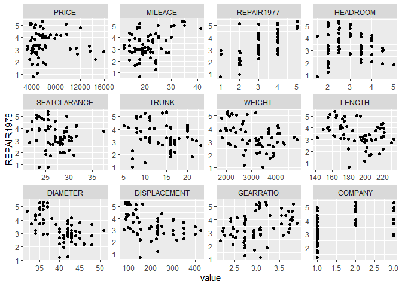
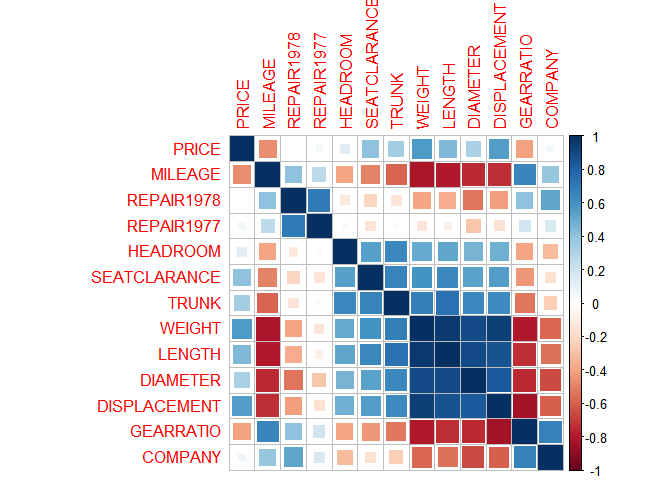
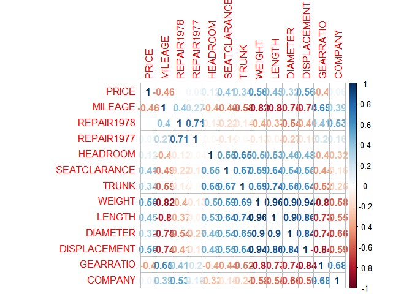
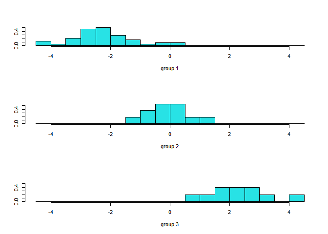
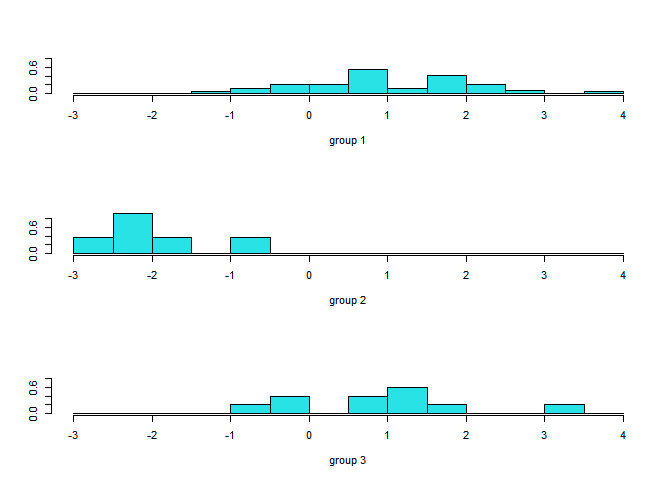
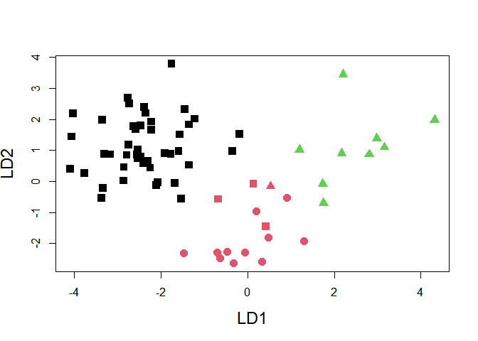

Untitled
================

# LDA 란?

**LDA 란?**<br>

  - LDA 란 Discriminant Analysis 의 한 방법으로서 Classification 의 한 방법이다.<br>
  - 그중에서 우리가 해볼것은 Fisher Linear discriminant 방법으로서 서로 다른 그룹을 잘 구별할 수 있게
    해주는 coefficient(linear 직선) 을 찾는 방법이다.
  - 분류할 때에 그룹이 잘 나누어져야 하므로 그룹내 분산은 작아야하고, 그룹간 분산은 커야한다. 듯 maximize
    그룹간ss/그룹내ss 를 하는 방향으로 vector a 를 찾게되고, 그 vector a 는 그룹들을 제일 잘
    구분하는 직선이 된다.
      - ‘수학적’ 으로 maximize 하는 vector a를 찾을 수 있다\!
  - 그리고 그러한 Vector a 를 많이 찾으면 더 정확하게 그룹간 ss 들을 measure 할 수 있다.(그룹이 3
    개인경우, 하나의 직선으로만 구분하기에는 벅차다. )
      - 최대 그룹의 수 J - 1 만큼의 Axis(vector a) 를 추가할 수 있다.(각 vector a 들은
        maximize 그룹간ss/그룹내ss을 계산해 주는 eigenvector 들이다. ) 그에 따라 최대 j-1 개의
        Axis를 형성가능하고 그에따라 분류 가능
  - 이때 LDA 의 Decision boundary 는 직선이다.
      - 왜냐하면 가정사항이 각 class\_k 의 pdf \~ N(mu\_k,sigma) 로 등분산,normal 이기
        때문이다.
      - 그래서 결정경계는 Normal 이 나온다.

**가정사항** <br>

  - 각 class 들은 등분산 Normal 의 분포를 가진다.

**장단점** <br>

  - 장점
      - 가정이 위반되도 어느정도는 Robust함
      - 필요한 모수의 수가 적어서 Calculation 이 빠름(mu\_1…mu\_k, sigma, pi\_1 …
        pi\_k)
          - hat(mu\_k) : class k 인 관측치 x 의 평균
          - hat(sigma) : 각 클래스내의 편차 제곱을 모두 더한뒤 N-k 로 나눔
          - hat(pi\_k) : 전체 관측치에서 class k 의 비율로 측정
  - 단점
      - 모델이 등분산을 가정해서 너무 딱딱함
      - 등분산이 아닌경우(class 크기가 다름) 안좋다.

# Analysis

  - 분석을 진행할 데이터는 차에 대한 데이터이다.
  - 자동차들에 대한 데이터로서 각 Col 들이 의미하는 바를 적어보면
      - Mileage : 연비
      - Repair : 수리상태 점수(정보가 없어 이것이라고 추측중)
      - Headroom : 자동차 실내의 시트 면부터 천장까지의 높이
      - Seatclearance : 앞 좌석과 뒷좌석 거리
      - Trunk : 트렁크 공간
      - Diameter : U 턴 하기위해 필요한 지름
      - Gear Ratio : 기어의 비율
      - Campany : 본사의 국정(1:미국,2:일본,3:유럽)

<!-- end list -->

``` r
set.seed(131)
library(readxl)
data_raw = read_excel('Data/CarData.xls',col_names = TRUE)
data_raw = data.frame(data_raw)
head(data_raw)
```

    ##       CARMARK PRICE MILEAGE REPAIR1978 REPAIR1977 HEADROOM SEATCLARANCE TRUNK
    ## 1 AMC_Concord  4099      22          3          2      2.5         27.5    11
    ## 2   AMC_Pacer  4749      17          3          1      3.0         25.5    11
    ## 3  AMC_Spirit  3799      22         NA         NA      3.0         18.5    12
    ## 4   Audi_5000  9690      17          5          2      3.0         27.0    15
    ## 5    Audi_Fox  6295      23          3          3      2.5         28.0    11
    ## 6    BMW_320i  9735      25          4          4      2.5         26.0    12
    ##   WEIGHT LENGTH DIAMETER DISPLACEMENT GEARRATIO COMPANY
    ## 1   2930    186       40          121      3.58       1
    ## 2   3350    173       40          258      2.53       1
    ## 3   2640    168       35          121      3.08       1
    ## 4   2830    189       37          131      3.20       3
    ## 5   2070    174       36           97      3.70       3
    ## 6   2650    177       34          121      3.64       3

## NA imputation

  - Na 가 들어가 있다. 이 떄에 무작정 KNN 이나, 평균 등으로 채우는 것보다는 데이터의 Structure 를 보고 난
    이후 결정해야 한다.

**Repair1978 의 관계 살펴보기**

``` r
library(reshape)
library(ggplot2)
data_plot <- na.omit(data_raw) # NA 지우기
data_plot <- data_plot[,unlist(lapply(data_plot,is.numeric))] # Numeric 만 추출 
df_melt = melt(data_plot,id=c('REPAIR1978')) # melt
head(df_melt)
```

    ##   REPAIR1978 variable value
    ## 1          3    PRICE  4099
    ## 2          3    PRICE  4749
    ## 3          5    PRICE  9690
    ## 4          3    PRICE  6295
    ## 5          4    PRICE  9735
    ## 6          3    PRICE  4816

``` r
ggplot(df_melt,aes(x=value,y=REPAIR1978))+
   facet_wrap(~variable, scales = "free") +
   geom_jitter()
```

<!-- -->

``` r
library(corrplot)
```

    ## corrplot 0.84 loaded

``` r
df_cor= cor(data_plot) 
corrplot(df_cor,method = 'square') # 1978,1977 끼리 연관 있어보이는듯
```

<!-- -->

``` r
corrplot(df_cor,method = 'number')
```

<!-- -->
데이터가 REPAIR값 끼리 연관성이 있어보인다.

``` r
data_raw 
```

    ##              CARMARK PRICE MILEAGE REPAIR1978 REPAIR1977 HEADROOM SEATCLARANCE
    ## 1        AMC_Concord  4099      22          3          2      2.5         27.5
    ## 2          AMC_Pacer  4749      17          3          1      3.0         25.5
    ## 3         AMC_Spirit  3799      22         NA         NA      3.0         18.5
    ## 4          Audi_5000  9690      17          5          2      3.0         27.0
    ## 5           Audi_Fox  6295      23          3          3      2.5         28.0
    ## 6           BMW_320i  9735      25          4          4      2.5         26.0
    ## 7      Buick_Century  4816      20          3          3      4.5         29.0
    ## 8      Buick_Electra  7827      15          4          4      4.0         31.5
    ## 9     Buick_Le_Sabre  5788      18          3          4      4.0         30.5
    ## 10        Buick_Opel  4453      26         NA         NA      3.0         24.0
    ## 11       Buick_Regal  5189      20          3          3      2.0         28.5
    ## 12     Buick_Riviera 10372      16          3          4      3.5         30.0
    ## 13     Buick_Skylark  4082      19          3          3      3.5         27.0
    ## 14      Cad._Deville 11385      14          3          3      4.0         31.5
    ## 15     Cad._Eldorado 14500      14          2          2      3.5         30.0
    ## 16      Cad._Seville 15906      21          3          3      3.0         30.0
    ## 17    Chev._Chevette  3299      29          3          3      2.5         26.0
    ## 18      Chev._Impala  5705      16          4          4      4.0         29.5
    ## 19      Chev._Malibu  4504      22          3          3      3.5         28.5
    ## 20 Chev._Monte_Carlo  5104      22          2          3      2.0         28.5
    ## 21       Chev._Monza  3667      24          2          2      2.0         25.0
    ## 22        Chev._Nova  3955      19          3          3      3.5         27.0
    ## 23     Datsun_200-SX  6229      23          4          3      1.5         21.0
    ## 24        Datsun_210  4589      35          5          5      2.0         23.5
    ## 25        Datsun_510  5079      24          4          4      2.5         22.0
    ## 26        Datsun_810  8129      21          4          4      2.5         27.0
    ## 27        Dodge_Colt  3984      30          5          4      2.0         24.0
    ## 28    Dodge_Diplomat  5010      18          2          2      4.0         29.0
    ## 29   Dodge_Magnum_XE  5886      16          2          2      3.5         26.0
    ## 30   Dodge_St._Regis  6342      17          2          2      4.5         28.0
    ## 31       Fiat_Strada  4296      21          3          1      2.5         26.5
    ## 32       Ford_Fiesta  4389      28          4         NA      1.5         26.0
    ## 33      Ford_Mustang  4187      21          3          3      2.0         23.0
    ## 34      Honda_Accord  5799      25          5          5      3.0         25.5
    ## 35       Honda_Civic  4499      28          4          4      2.5         23.5
    ## 36 Linc._Continental 11497      12          3          4      3.5         30.5
    ## 37 Linc._Cont_Mark_V 13594      12          3          4      2.5         28.5
    ## 38  Linc._Versailles 13466      14          3          3      3.5         27.0
    ## 39         Mazda_GLC  3995      30          4          4      3.5         25.5
    ## 40      Merc._Bobcat  3829      22          4          3      3.0         25.5
    ## 41      Merc._Cougar  5379      14          4          3      3.5         29.5
    ## 42 Merc._Cougar_XR-7  6303      14          4          4      3.0         25.0
    ## 43     Merc._Marquis  6165      15          3          2      3.5         30.5
    ## 44     Merc._Monarch  4516      18          3         NA      3.0         27.0
    ## 45      Merc._Zephyr  3291      20          3          3      3.5         29.0
    ## 46          Olds._98  8814      21          4          4      4.0         31.5
    ## 47     Olds._Cutlass  4733      19          3          3      4.5         28.0
    ## 48   Olds._Cutl_Supr  5172      19          3          4      2.0         28.0
    ## 49    Olds._Delta_88  5890      18          4          4      4.0         29.0
    ## 50       Olds._Omega  4181      19          3          3      4.5         27.0
    ## 51    Olds._Starfire  4195      24          1          1      2.0         25.5
    ## 52     Olds._Tornado 10371      16          3          3      3.5         30.0
    ## 53    Peugeot_604_SL 12990      14         NA         NA      3.5         30.5
    ## 54       Plym._Arrow  4647      28          3          3      2.0         21.5
    ## 55       Plym._Champ  4425      34          5          4      2.5         23.0
    ## 56     Plym._Horizon  4482      25          3         NA      4.0         25.0
    ## 57     Plym._Sapporo  6486      26         NA         NA      1.5         22.0
    ## 58      Plym._Volare  4060      18          2          2      5.0         31.0
    ## 59    Pont._Catalina  5798      18          4          4      4.0         29.0
    ## 60    Pont._Firebird  4934      18          1          2      1.5         23.5
    ## 61  Pont._Grand_Prix  5222      19          3          3      2.0         28.5
    ## 62     Pont._Le_Mans  4723      19          3          3      3.5         28.0
    ## 63     Pont._Phoenix  4424      19         NA         NA      3.5         27.0
    ## 64     Pont._Sunbird  4172      24          2          2      2.0         25.0
    ## 65    Renault_Le_Car  3895      26          3          3      3.0         23.0
    ## 66            Subaru  3798      35          5          4      2.5         25.5
    ## 67     Toyota_Cecila  5899      18          5          5      2.5         22.0
    ## 68    Toyota_Corolla  3748      31          5          5      3.0         24.5
    ## 69     Toyota_Corona  5719      18          5          5      2.0         23.0
    ## 70         VW_Rabbit  4697      25          4          3      3.0         25.5
    ## 71  VW_Rabbit_Diesel  5397      41          5          4      3.0         25.5
    ## 72       VW_Scirocco  6850      25          4          3      2.0         23.5
    ## 73         VW_Dasher  7140      23          4          3      2.5         37.5
    ## 74         Volvo_260 11995      17          5          3      2.5         29.5
    ##    TRUNK WEIGHT LENGTH DIAMETER DISPLACEMENT GEARRATIO COMPANY
    ## 1     11   2930    186       40          121      3.58       1
    ## 2     11   3350    173       40          258      2.53       1
    ## 3     12   2640    168       35          121      3.08       1
    ## 4     15   2830    189       37          131      3.20       3
    ## 5     11   2070    174       36           97      3.70       3
    ## 6     12   2650    177       34          121      3.64       3
    ## 7     16   3250    196       40          196      2.93       1
    ## 8     20   4080    222       43          350      2.41       1
    ## 9     21   3670    218       43          231      2.73       1
    ## 10    10   2230    170       34          304      2.87       1
    ## 11    16   3280    200       42          196      2.93       1
    ## 12    17   3880    207       43          231      2.93       1
    ## 13    13   3400    200       42          231      3.08       1
    ## 14    20   4330    221       44          425      2.28       1
    ## 15    16   3900    204       43          350      2.19       1
    ## 16    13   4290    204       45          350      2.24       1
    ## 17     9   2110    163       34          231      2.93       1
    ## 18    20   3690    212       43          250      2.56       1
    ## 19    17   3180    193       41          200      2.73       1
    ## 20    16   3220    200       41          200      2.73       1
    ## 21     7   2750    179       40          151      2.73       1
    ## 22    13   3430    197       43          250      2.56       1
    ## 23     6   2370    170       35          119      3.89       2
    ## 24     8   2020    165       32           85      3.70       2
    ## 25     8   2280    170       34          119      3.54       2
    ## 26     8   2750    184       38          146      3.55       2
    ## 27     8   2120    163       35           98      3.54       1
    ## 28    17   3600    206       46          318      2.47       1
    ## 29    16   3870    216       48          318      2.71       1
    ## 30    21   3740    220       46          225      2.94       1
    ## 31    16   2130    161       36          105      3.37       3
    ## 32     9   1800    147       33           98      3.15       3
    ## 33    10   2650    179       42          140      3.08       1
    ## 34    10   2240    172       36          107      3.05       2
    ## 35     5   1760    149       34           91      3.30       2
    ## 36    22   4840    233       51          400      2.47       1
    ## 37    18   4720    230       48          400      2.47       1
    ## 38    15   3830    201       41          302      2.47       1
    ## 39    11   1980    154       33           86      3.73       2
    ## 40     9   2580    169       39          140      2.73       1
    ## 41    16   4060    221       48          302      2.75       1
    ## 42    16   4130    217       45          302      2.75       1
    ## 43    23   3720    212       44          302      2.26       1
    ## 44    15   3370    198       41          250      2.43       1
    ## 45    17   2830    195       43          140      3.08       1
    ## 46    20   4060    220       43          350      2.41       1
    ## 47    16   3300    198       42          231      2.93       1
    ## 48    16   3310    198       42          231      2.93       1
    ## 49    20   3690    218       42          231      2.73       1
    ## 50    14   3370    200       43          231      3.08       1
    ## 51    10   2720    180       40          151      2.73       1
    ## 52    17   4030    206       43          350      2.41       1
    ## 53    14   3420    192       38          163      3.58       3
    ## 54    11   2360    170       37          156      3.05       1
    ## 55    11   1800    157       37           86      2.97       1
    ## 56    17   2200    165       36          105      3.37       1
    ## 57     8   2520    182       38          119      3.54       1
    ## 58    16   3330    201       44          225      3.23       1
    ## 59    20   3700    214       42          231      2.73       1
    ## 60     7   3470    198       42          231      3.08       1
    ## 61    16   3210    201       45          231      2.93       1
    ## 62    17   3200    199       40          231      2.93       1
    ## 63    13   3420    203       43          231      3.08       1
    ## 64     7   2690    179       41          151      2.73       1
    ## 65    10   1830    142       34           79      3.72       1
    ## 66    11   2050    164       36           97      3.81       2
    ## 67    14   2410    174       36          134      3.06       2
    ## 68     9   2200    165       35           97      3.21       2
    ## 69    11   2670    175       36          134      3.05       2
    ## 70    15   1930    155       35           89      3.78       3
    ## 71    15   2040    155       35           90      3.78       3
    ## 72    16   1990    156       36           97      3.78       3
    ## 73    12   2160    172       36           97      3.74       3
    ## 74    14   3170    193       37          163      2.98       3

또한 차 종류마다 repair 의 값이 비슷해보인다. <br> 그러므로 차 회사에 따라 Repair 1978 의 값과 1977 의
값의 추이를 보고 비슷하게 맞추면 될 것이다. <br>

``` r
data_raw[32,'REPAIR1977'] = 4 # Ford_Fiesta
data_raw[44,'REPAIR1977'] = 2 # Merc._Monarch
data_raw[56,'REPAIR1977'] = 3 # Plym._Horizon
data_raw = data_raw[-c(3,10,53,57,63),] # NA 가 두개인 데이터는 삭제
row.names(data_raw) <- NULL
data = data_raw[,-c(1,14)]
```

## LDA

``` r
library('MASS')
```

    ## Warning: package 'MASS' was built under R version 4.0.3

``` r
data_fisher=data_raw[,-1]
fisher=lda(COMPANY~.,prior=c(1,1,1)/3,data=data_fisher)
# Prior 는 아무것도 모른다고 가정하면 c(1,1,1)/3 이 된다.
# defualt 는 데이터의 비율에 따라 추정하게 된다.
fisher
```

    ## Call:
    ## lda(COMPANY ~ ., data = data_fisher, prior = c(1, 1, 1)/3)
    ## 
    ## Prior probabilities of groups:
    ##         1         2         3 
    ## 0.3333333 0.3333333 0.3333333 
    ## 
    ## Group means:
    ##      PRICE  MILEAGE REPAIR1978 REPAIR1977 HEADROOM SEATCLARANCE     TRUNK
    ## 1 6210.625 19.50000   3.000000   2.958333 3.208333     27.59375 15.083333
    ## 2 5225.727 26.18182   4.545455   4.363636 2.500000     23.90909  9.181818
    ## 3 7048.400 24.50000   4.100000   3.000000 2.500000     27.50000 13.500000
    ##     WEIGHT   LENGTH DIAMETER DISPLACEMENT GEARRATIO
    ## 1 3355.625 197.5208 42.02083     236.6458  2.795417
    ## 2 2248.182 167.4545 35.00000     110.4545  3.444545
    ## 3 2277.000 167.9000 35.50000     108.8000  3.512000
    ## 
    ## Coefficients of linear discriminants:
    ##                        LD1           LD2
    ## PRICE         2.807160e-04 -3.459205e-06
    ## MILEAGE      -7.182793e-02  6.367450e-02
    ## REPAIR1978    7.654886e-01 -1.585610e-01
    ## REPAIR1977   -6.208799e-01 -8.927166e-01
    ## HEADROOM     -5.856658e-01 -5.329735e-01
    ## SEATCLARANCE  1.591091e-01  1.841096e-01
    ## TRUNK         1.344231e-01  2.555883e-01
    ## WEIGHT       -1.499608e-03  1.468163e-03
    ## LENGTH        3.107973e-03 -5.176192e-02
    ## DIAMETER     -1.069221e-01  7.897361e-02
    ## DISPLACEMENT  5.175148e-05 -5.838786e-03
    ## GEARRATIO     1.994174e+00 -4.184959e-01
    ## 
    ## Proportion of trace:
    ##   LD1   LD2 
    ## 0.629 0.371

## confusion matrix

  - predict 한 값은 posterior 에서 확률값으로 나타난다.
  - 각 클래스 1,2,3 에 대해 예측한 확률값을 볼 수 있다.
  - 그에 따라서 클리스 1,2,3 의 예측은 class 에서 볼 수 있다.

<!-- end list -->

``` r
pred = predict(fisher,data_fisher)
pred$posterior
```

    ##               1            2            3
    ## 1  7.193059e-01 1.270592e-02 2.679882e-01
    ## 2  9.999736e-01 1.001804e-05 1.640927e-05
    ## 3  6.915655e-07 7.003625e-05 9.999293e-01
    ## 4  3.837336e-04 6.173249e-02 9.378838e-01
    ## 5  2.584957e-04 2.890700e-01 7.106715e-01
    ## 6  9.988325e-01 1.154473e-03 1.302123e-05
    ## 7  9.975268e-01 2.455684e-03 1.755376e-05
    ## 8  9.998061e-01 1.902982e-04 3.587652e-06
    ## 9  9.962439e-01 4.145922e-04 3.341487e-03
    ## 10 9.949666e-01 4.359204e-03 6.741568e-04
    ## 11 9.951487e-01 4.849035e-03 2.267643e-06
    ## 12 9.998268e-01 1.349774e-04 3.821274e-05
    ## 13 9.987484e-01 9.849213e-05 1.153125e-03
    ## 14 9.999030e-01 6.114329e-05 3.580984e-05
    ## 15 6.552499e-01 3.441255e-01 6.245849e-04
    ## 16 9.989037e-01 1.087028e-03 9.320664e-06
    ## 17 9.999352e-01 5.252828e-05 1.223899e-05
    ## 18 9.999605e-01 1.997588e-05 1.955659e-05
    ## 19 9.998642e-01 1.355129e-04 2.888093e-07
    ## 20 9.998992e-01 1.008405e-04 8.418646e-09
    ## 21 5.952724e-05 9.766146e-01 2.332589e-02
    ## 22 6.502337e-05 9.996134e-01 3.215975e-04
    ## 23 2.389314e-04 9.996996e-01 6.147415e-05
    ## 24 5.251559e-04 9.946868e-01 4.788089e-03
    ## 25 1.701124e-03 9.862506e-01 1.204831e-02
    ## 26 9.999995e-01 5.351069e-07 1.007014e-08
    ## 27 9.999954e-01 4.597534e-06 8.841130e-09
    ## 28 9.999931e-01 3.381282e-06 3.499337e-06
    ## 29 6.020853e-05 6.158347e-07 9.999392e-01
    ## 30 3.816369e-02 5.615951e-01 4.002412e-01
    ## 31 9.686251e-01 3.129960e-02 7.528448e-05
    ## 32 8.034399e-04 9.991479e-01 4.863053e-05
    ## 33 1.610105e-03 9.983173e-01 7.261102e-05
    ## 34 9.999956e-01 4.165291e-06 2.142686e-07
    ## 35 9.992445e-01 7.465323e-04 8.928022e-06
    ## 36 9.693766e-01 2.859391e-02 2.029525e-03
    ## 37 1.217511e-02 9.575521e-01 3.027279e-02
    ## 38 9.610390e-01 3.889615e-02 6.486881e-05
    ## 39 9.995348e-01 4.622544e-04 2.968208e-06
    ## 40 9.913894e-01 8.610365e-03 2.303758e-07
    ## 41 9.997279e-01 5.909280e-07 2.715463e-04
    ## 42 9.999546e-01 3.967445e-05 5.728922e-06
    ## 43 9.983941e-01 8.936453e-04 7.122605e-04
    ## 44 9.995234e-01 4.670895e-04 9.503670e-06
    ## 45 9.986891e-01 1.308626e-03 2.259012e-06
    ## 46 9.971727e-01 2.664663e-03 1.626443e-04
    ## 47 9.946075e-01 5.356982e-03 3.548697e-05
    ## 48 9.965010e-01 3.498773e-03 2.562624e-07
    ## 49 9.999953e-01 1.776783e-06 2.912533e-06
    ## 50 9.998302e-01 1.335542e-04 3.622809e-05
    ## 51 9.242356e-01 7.531598e-02 4.484194e-04
    ## 52 2.155405e-01 7.745601e-01 9.899323e-03
    ## 53 7.990888e-01 5.249587e-02 1.484153e-01
    ## 54 9.999366e-01 5.623969e-05 7.172190e-06
    ## 55 9.975381e-01 2.434308e-03 2.760500e-05
    ## 56 9.996735e-01 3.264345e-04 3.787434e-08
    ## 57 9.975704e-01 5.490620e-04 1.880584e-03
    ## 58 9.959100e-01 3.793539e-03 2.964228e-04
    ## 59 9.998153e-01 1.842025e-04 5.083006e-07
    ## 60 1.318716e-01 6.353805e-01 2.327479e-01
    ## 61 6.159814e-03 6.357007e-01 3.581395e-01
    ## 62 3.942677e-04 9.992843e-01 3.214020e-04
    ## 63 8.273753e-03 9.917150e-01 1.126321e-05
    ## 64 1.022576e-03 9.988463e-01 1.311110e-04
    ## 65 5.989765e-05 1.272477e-03 9.986676e-01
    ## 66 4.866355e-03 8.460226e-03 9.866734e-01
    ## 67 1.560103e-06 4.570261e-05 9.999527e-01
    ## 68 3.813620e-09 3.412380e-07 9.999997e-01
    ## 69 3.354836e-06 3.175599e-04 9.996791e-01

``` r
pred$class
```

    ##  [1] 1 1 3 3 3 1 1 1 1 1 1 1 1 1 1 1 1 1 1 1 2 2 2 2 2 1 1 1 3 2 1 2 2 1 1 1 2 1
    ## [39] 1 1 1 1 1 1 1 1 1 1 1 1 1 2 1 1 1 1 1 1 1 2 2 2 2 2 3 3 3 3 3
    ## Levels: 1 2 3

``` r
pred_class = predict(fisher,data_fisher)$class
# confusion matrix
table(data_fisher$COMPANY,pred_class)
```

    ##    pred_class
    ##      1  2  3
    ##   1 45  3  0
    ##   2  0 11  0
    ##   3  0  1  9

## Lda Axis histogram

LDA 는 Axis 를 최대 J(class 갯수)-1 개 쓸 수 있다고 하였다. <br> 현재 분류하려는 class 가 3개
이므로 2개의 Axis 를 쓸 수 있다. <br> 각각의 Axis 마다 데이터가 projection 되면 어떤
histogram 을 그리는지를 시각적으로 확인하고, 잘 분류가 될 수 있는지를 체크할 수 있다.

``` r
# histogram 그리기
val=0
lda.values <- predict(fisher)
lda.values$x
```

    ##            LD1         LD2
    ## 1  -0.18902159  1.53009805
    ## 2  -2.39461965  2.39652811
    ## 3   3.15866586  1.10069236
    ## 4   1.73239246 -0.08194601
    ## 5   1.75020005 -0.70712480
    ## 6  -2.46665151  0.78201730
    ## 7  -2.40300399  0.57919661
    ## 8  -2.74665760  1.17331068
    ## 9  -1.22373500  2.01605044
    ## 10 -1.59088421  0.97617973
    ## 11 -2.86210699  0.02286346
    ## 12 -2.21729072  1.66876370
    ## 13 -1.45543094  2.32247756
    ## 14 -2.22835017  1.92138578
    ## 15 -1.53557164 -0.55892614
    ## 16 -2.54101103  0.74813205
    ## 17 -2.46725763  1.79878451
    ## 18 -2.35846947  2.19553508
    ## 19 -3.30738908  0.87998402
    ## 20 -4.09497935  0.40828796
    ## 21  1.30377967 -1.91345843
    ## 22  0.32842204 -2.59665716
    ## 23 -0.32553608 -2.64084457
    ## 24  0.47402334 -1.80243840
    ## 25  0.42282474 -1.44984928
    ## 26 -4.03221178  2.17760567
    ## 27 -4.07062332  1.44208909
    ## 28 -2.73470465  2.50827019
    ## 29  2.20206491  3.43721813
    ## 30  0.52641982 -0.16609934
    ## 31 -2.08276509 -0.03668634
    ## 32 -0.64315475 -2.47103956
    ## 33 -0.70579039 -2.28726012
    ## 34 -3.35886488  1.98875517
    ## 35 -2.54905264  0.86608777
    ## 36 -1.34745547  0.52450960
    ## 37  0.19794782 -0.95493898
    ## 38 -2.11521844 -0.13422166
    ## 39 -2.79275796  0.84786117
    ## 40 -3.37405252 -0.53716011
    ## 41 -1.75604281  3.78917214
    ## 42 -2.63542468  1.76965830
    ## 43 -1.57246529  1.51210626
    ## 44 -2.53312867  1.03198993
    ## 45 -2.85802956  0.45799433
    ## 46 -1.90650657  0.91087452
    ## 47 -2.24869276  0.43303380
    ## 48 -3.34749276 -0.21993553
    ## 49 -2.77285978  2.69244796
    ## 50 -2.22914627  1.66368854
    ## 51 -1.67814375 -0.04877608
    ## 52 -0.67928157 -0.57319378
    ## 53 -0.35007349  0.98152673
    ## 54 -2.58680472  1.68995794
    ## 55 -2.30194661  0.65508134
    ## 56 -3.76448360  0.26040931
    ## 57 -1.35351794  1.83029179
    ## 58 -1.77383474  0.89006525
    ## 59 -3.18257312  0.86912095
    ## 60  0.13363571 -0.08244041
    ## 61  0.90010551 -0.53710573
    ## 62 -0.06602285 -2.28841914
    ## 63 -1.47970211 -2.30553384
    ## 64 -0.47461085 -2.26981945
    ## 65  2.16966329  0.90015262
    ## 66  1.19662113  1.02090466
    ## 67  2.98253885  1.38163866
    ## 68  4.31963216  1.98011841
    ## 69  2.80652186  0.86853055

``` r
ldahist(data = lda.values$x[,1], g=data_fisher$COMPANY, nbins=20)
```

<!-- -->

``` r
ldahist(data = lda.values$x[,2], g=data_fisher$COMPANY, nbins=20)
```

<!-- -->
- lda.values$x 는 실제 projection 의 값을 나타낸다. 이 때에 coefficient 의 절대적인 크기는
의미가 없으므로( (0.4,0.4) = (1,1) ) coef 와 data를 곱해 계산한 값이 달라도 당황하지
말자.<br> - lda Axis 에 투영한 값들의 비교를 보면 확실히 Axis 들이 잘 구분하고 있음을 볼 수 있다.

## Result visualization

``` r
# LD 값에 따라 분류된 모양
score=pred$x
plot(score[,1],score[,2],col=pred$class,
     cex=1.5,xlab='LD1',ylab='LD2',cex.lab =1.5,
     pch = data_raw$COMPANY+14)
```

<!-- -->
회사의 국적에 따라 모양을 다르게 주었다. <br>
