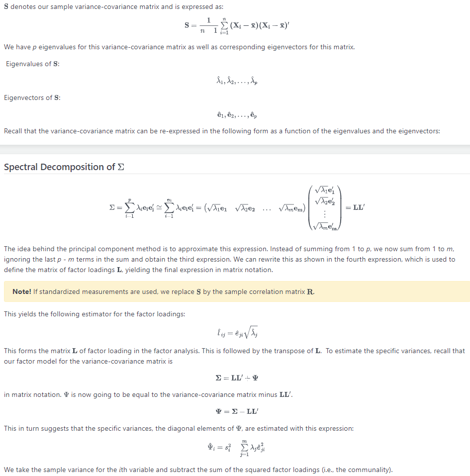
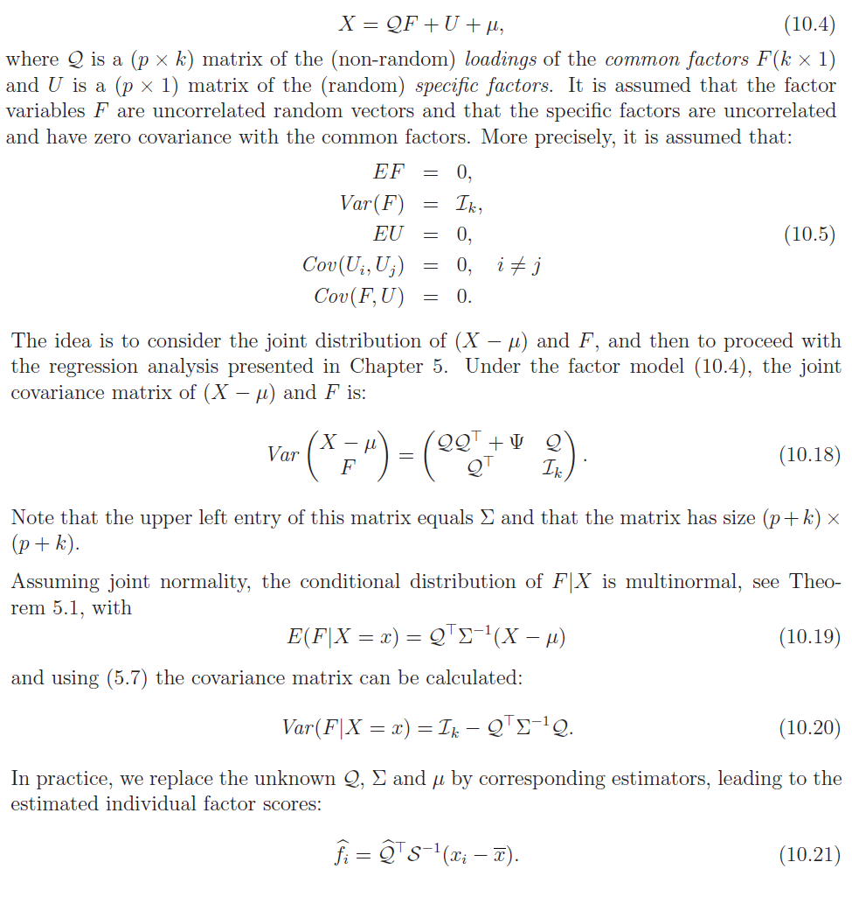

# FA란?
- FA 는 우리가 관찰하게 되는 값들이 사실은 잠재 요인들이 있어, 이 값들이 X 값에 대해 영향을 준다고 생각한다.
  - ex) 삶의 질, 행복은 관측할 수 없지만 경제 변수에 큰 영향을 끼친다.
- Assumption
  - predictor가 사실은 잠재변수들의 선형결합 + 오차항으로 이루져 있다.
  - 이 때 잠재변수들 끼리는 서로 독립이다.
  - 오차항과 잠재변수 끼리도 독립이다.
- X - mu = LF - e 의 관계를 가진다.
  - mu : x1.... xp의 평균
  - F : 잠재변수 f1... fd
  - L : Loading matrix(p*d)
  - e : 에러 e1....ep
- 위 모델에 따라서 각 X 값들이 잠재변수들에 대해 선형적으로 어떠한 관계가 있다고 생각할 수 있다.   
  - ex) 수학,과학.영어,사회 점수에 대해 수리능력, 독해능력 이라는 2개의 변수가 linear 하게 영향을 끼친다고 가정할 수 있다.
  
# Analysis
- 데이터 분석을 진행할 데이터는 US Crime 데이터로, 미국 각 주에 대한 땅의 크기, 인구, 각종 범죄에 대한 범죄율 변수가 있고, 마지막에는 지역을 구분하는 int 값이 있다.
```{r}
data_raw <- read.csv('./Data/UScrime.csv')
head(data_raw)
set.seed(131026)
```

첫 둘과 마지막 둘 값은 빼고, 각 범죄들에 대해서 분석해보자.
```{r}
data <- data_raw[,-c(1,2,10,11)]
head(data)
```

2개 factor 에 대해서 FA 를 진행하여보자.
```{R}
# 2 factor analysis
factor = factanal(data, factor = 2, 
                  scores = 'regression', 
                  rotation = 'varimax') 
print(factor,cutoff=0)
```
- L(loadings 의 추정)
  - X - mu = LF - e 에서  L matrix 는 추정이 가능한데(Sample variance 의 SVD 를 통해서), 이를 통해 각 factor 의 계수가 되어서 각 variable 에 대해 factor 가 얼마나 영향을 끼치는지는 알 수 있다. 



- ex) 키 변수에 대해 키 = 2Factor_1-4factor_2 가 되면 factor 1 은 키에 긍정적 영향(부모님의 애정), factor 2는 키에 부정적 영향을 끼치는 잠재변수(영양결핍) 등이 될 수 있다.

- F(공통인자, 잠재변수) 의 추정
  - X - mu = LF - e 에서 L 은 알 수 있었다. 하지만 Observatiion 에 대해서 분석하려면 어떻게 해야할까?
  - 떄에 Factor 들은 random variable 이여서 구체적인 값이 아니라 우리가 추정해야 한다..
  - 각 ith Obs 에 대해서 아래 그림과 같이 F 의 값을 예측할 수 있다. (이를 factor score 이라 한다.)



- 위와 같은 방식으로 Normal 분포를 가정하게 된다면 , 그 conditional 을 구하기 쉽게 되고 각 F 값을 예측할 수 있게 된다.
- 이를 통해서 각 element 들의 잠재변수가 가지는 값을 알 수 있다. 

- communility
  - communility 는 잠재변수들이 설명하는 variable 의 분산의 설명력이다. 이 값이 커야 잠재변수가 variable 을 잘 설명하고 있는 것이다. (이 값은 loadings 계수의 제곱의 합이다.) 
- Uniqueness
  - Uniqueness 는 1-communility 이다. 즉 Uniqueness 가 작은 값은 공통인자(잠재변수) 들이 잘 설명하고 있는것이다.
- SS loadings
  - SS loadings 는 각 FA가 총 계수들의 분산의 합을 얼마나 잘 설명하고 있는지이다. 
  - 각 계수들은 정규화 된 이후에 fa 가 진행되므로, 변수 갯수 = 계수들의 분산의 합 이 된다. 즉 (2.836 + 2.183)/7 = 0.717 의 관계가 성립하는것 
  - 2개의 변수만으로, 계수들의 분산은 0.72 가량 설명하고 있으므로 훌륭하다고 볼 수 있다.
- Rotation
  - FA 는 요인벡터(F) 를 회전시켜도 공분산 구조가 같고, 그에 따라서 요인을 회전할 수 있다. 
  - varimax : (직교 회전)가장 대중적이다. 분산이 극대화 된다는 의미로, 요인의 분산을 극대화 하기 위해서 대게 한쪽은 1,-1 에 가깝게, 한쪽은 0에 가깝게(즉 축에 가깝게) 변환하려 한다.
    - 계산이 단순하고, 요인구조의 해석이 쉽지만 상관관계가 없다고 못박아 버린다. 
  - oblique : (삐뚤어지게 회전)좌표죽간의 직각을 인정하지 않고 회전시킨다. 이는 두 요인이 Covariance 를 가질 수 있게 해준다. 
    - 그러나 요인 구조의 해석이 어렵고(상관관계가 생겨버림), 계산이 어렵다. 
  - promax : (삐뚤어진 회전)좀더 빠르다고 알려진 회전 

```{R}
#3 factor 
factor_3 = factanal(data, factor = 3, 
                    scores = 'regression', 
                    rotation = 'promax') 
print(factor_3,cutoff=0)
```
- 결과를 보면 직교회전이 아니기 때문에 Factor 간 correlation 이 발생한 것을 볼 수 있다.
- 그리고 Test 의 결과또한 p 값이 0.798 로서 3개의 factor 가 충분함을 시사하고 있다.
- 각 FA 값의 계수를 참고해서 주관적으로 어떤 의미를 가지는지 해석이 가능하다.

# Clustering with FA
- K-means 는 dimenstion 이 클 때에 그 효과가 떨어진다.
- 이를 보완하는 방법이 바로 Dim - reduction 후에 k-means 를 적용하는 것이다. 또한 시각화 하기에도 적합해서 매우 좋은 방법이다.
```{r}
library(NbClust)
# FA with kmean
score = factor_3$scores
score = data.frame(score)
TEST = NbClust(score, method = "kmeans") ; TEST
# nb clisterng 으로 과 clustering 의 수가 언제 적합한지 테스트
kmean = kmeans(score,center=4)
kmean
```


```{r}
#library(plotly)
#col = factor(kmean$cluster)
#plot_ly(score, x=score[,1],y=score[,2],z=score[,3],
#        color=col,
#        symbol = as.factor(col),
#        symbols = c('circle','square','diamond','x')) %>%
#  add_markers()  %>%
#  layout(scene = list(xaxis = list(title = '파괴심리'),
#                      yaxis = list(title = '욕망'),
#                      zaxis = list(title = '가난')))
```
- 위 코드는 md 에서 출력이 안되는 interactive plot 이기 때문에 주석으로 남긴다.
- 임의로 각 FA 값에 대해서 내 해석을 덧붙였다.

# Reference
- https://online.stat.psu.edu/stat505/lesson/12/12.3
- Applied Multivariate Statistical Analysis(Härdle,Wolfgang Karl) 
- https://blog.naver.com/shoutjoy/221802826087
