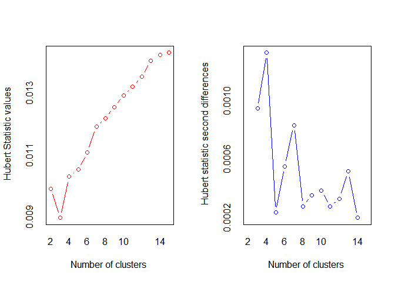
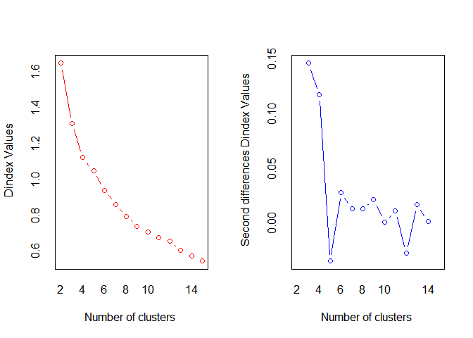

Factor analysis
================

# FA란?

  - FA 는 우리가 관찰하게 되는 값들이 사실은 잠재 요인들이 있어, 이 값들이 X 값에 대해 영향을 준다고 생각한다.
      - ex) 삶의 질, 행복은 관측할 수 없지만 경제 변수에 큰 영향을 끼친다.
  - Assumption
      - predictor가 사실은 잠재변수들의 선형결합 + 오차항으로 이루져 있다.
      - 이 때 잠재변수들 끼리는 서로 독립이다.
      - 오차항과 잠재변수 끼리도 독립이다.
  - X - mu = LF - e 의 관계를 가진다.
      - mu : x1…. xp의 평균
      - F : 잠재변수 f1… fd
      - L : Loading matrix(p\*d)
      - e : 에러 e1….ep
  - 위 모델에 따라서 각 X 값들이 잠재변수들에 대해 선형적으로 어떠한 관계가 있다고 생각할 수 있다.
      - ex) 수학,과학.영어,사회 점수에 대해 수리능력, 독해능력 이라는 2개의 변수가 linear 하게 영향을 끼친다고
        가정할 수 있다.

# Analysis

  - 데이터 분석을 진행할 데이터는 US Crime 데이터로, 미국 각 주에 대한 땅의 크기, 인구, 각종 범죄에 대한 범죄율
    변수가 있고, 마지막에는 지역을 구분하는 int 값이 있다.

<!-- end list -->

``` r
data_raw <- read.csv('./Data/UScrime.csv')
head(data_raw)
```

    ##   LANDAREA POPU1985 MURD RAPE  ROB ASSA BURG LARC AUTO REG DIV
    ## 1    33265     1164  1.5  7.0 12.6   62  562 1055  146   1   1
    ## 2     9279      998  2.0  6.0 12.1   36  566  929  172   1   1
    ## 3     9614      535  1.3 10.3  7.6   55  731  969  124   1   1
    ## 4     8284     5822  3.5 12.0 99.5   88 1134 1531  878   1   1
    ## 5     1212      968  3.2  3.6 78.3  120 1019 2186  859   1   1
    ## 6     5018     3174  3.5  9.1 70.4   87 1084 1751  484   1   1

``` r
set.seed(131026)
```

첫 둘과 마지막 둘 값은 빼고, 각 범죄들에 대해서 분석해보자.

``` r
data <- data_raw[,-c(1,2,10,11)]
head(data)
```

    ##   MURD RAPE  ROB ASSA BURG LARC AUTO
    ## 1  1.5  7.0 12.6   62  562 1055  146
    ## 2  2.0  6.0 12.1   36  566  929  172
    ## 3  1.3 10.3  7.6   55  731  969  124
    ## 4  3.5 12.0 99.5   88 1134 1531  878
    ## 5  3.2  3.6 78.3  120 1019 2186  859
    ## 6  3.5  9.1 70.4   87 1084 1751  484

2개 factor 에 대해서 FA 를 진행하여보자.

``` r
# 2 factor analysis
factor = factanal(data, factor = 2, 
                  scores = 'regression', 
                  rotation = 'varimax') 
print(factor,cutoff=0)
```

    ## 
    ## Call:
    ## factanal(x = data, factors = 2, scores = "regression", rotation = "varimax")
    ## 
    ## Uniquenesses:
    ##  MURD  RAPE   ROB  ASSA  BURG  LARC  AUTO 
    ## 0.247 0.338 0.510 0.053 0.087 0.275 0.471 
    ## 
    ## Loadings:
    ##      Factor1 Factor2
    ## MURD 0.037   0.867  
    ## RAPE 0.590   0.560  
    ## ROB  0.564   0.415  
    ## ASSA 0.302   0.925  
    ## BURG 0.918   0.265  
    ## LARC 0.849   0.064  
    ## AUTO 0.717   0.122  
    ## 
    ##                Factor1 Factor2
    ## SS loadings      2.836   2.183
    ## Proportion Var   0.405   0.312
    ## Cumulative Var   0.405   0.717
    ## 
    ## Test of the hypothesis that 2 factors are sufficient.
    ## The chi square statistic is 12.11 on 8 degrees of freedom.
    ## The p-value is 0.146

  - L(loadings 의 추정)
      - X - mu = LF - e 에서 L matrix 는 추정이 가능한데(Sample variance 의 SVD 를
        통해서), 이를 통해 각 factor 의 계수가 되어서 각 variable 에 대해 factor 가 얼마나
        영향을 끼치는지는 알 수 있다.


  - ex) 키 변수에 대해 키 = 2Factor\_1-4factor\_2 가 되면 factor 1 은 키에 긍정적
    영향(부모님의 애정), factor 2는 키에 부정적 영향을 끼치는 잠재변수(영양결핍) 등이 될 수
    있다.

  - F(공통인자, 잠재변수) 의 추정
    
      - X - mu = LF - e 에서 L 은 알 수 있었다. 하지만 Observatiion 에 대해서 분석하려면 어떻게
        해야할까?
      - 떄에 Factor 들은 random variable 이여서 구체적인 값이 아니라 우리가 추정해야 한다..
      - 각 ith Obs 에 대해서 아래 그림과 같이 F 의 값을 예측할 수 있다. (이를 factor score 이라
        한다.)


  - 위와 같은 방식으로 Normal 분포를 가정하게 된다면 , 그 conditional 을 구하기 쉽게 되고 각 F 값을
    예측할 수 있게 된다.

  - 이를 통해서 각 element 들의 잠재변수가 가지는 값을 알 수 있다.

  - communility
    
      - communility 는 잠재변수들이 설명하는 variable 의 분산의 설명력이다. 이 값이 커야 잠재변수가
        variable 을 잘 설명하고 있는 것이다. (이 값은 loadings 계수의 제곱의 합이다.)

  - Uniqueness
    
      - Uniqueness 는 1-communility 이다. 즉 Uniqueness 가 작은 값은 공통인자(잠재변수)
        들이 잘 설명하고 있는것이다.

  - SS loadings
    
      - SS loadings 는 각 FA가 총 계수들의 분산의 합을 얼마나 잘 설명하고 있는지이다.
      - 각 계수들은 정규화 된 이후에 fa 가 진행되므로, 변수 갯수 = 계수들의 분산의 합 이 된다. 즉 (2.836 +
        2.183)/7 = 0.717 의 관계가 성립하는것
      - 2개의 변수만으로, 계수들의 분산은 0.72 가량 설명하고 있으므로 훌륭하다고 볼 수 있다.

  - Rotation
    
      - FA 는 요인벡터(F) 를 회전시켜도 공분산 구조가 같고, 그에 따라서 요인을 회전할 수 있다.
      - varimax : (직교 회전)가장 대중적이다. 분산이 극대화 된다는 의미로, 요인의 분산을 극대화 하기 위해서
        대게 한쪽은 1,-1 에 가깝게, 한쪽은 0에 가깝게(즉 축에 가깝게) 변환하려 한다.
          - 계산이 단순하고, 요인구조의 해석이 쉽지만 상관관계가 없다고 못박아 버린다.
      - oblique : (삐뚤어지게 회전)좌표죽간의 직각을 인정하지 않고 회전시킨다. 이는 두 요인이 Covariance
        를 가질 수 있게 해준다.
          - 그러나 요인 구조의 해석이 어렵고(상관관계가 생겨버림), 계산이 어렵다.
      - promax : (삐뚤어진 회전)좀더 빠르다고 알려진 회전

<!-- end list -->

``` r
#3 factor 
factor_3 = factanal(data, factor = 3, 
                    scores = 'regression', 
                    rotation = 'promax') 
print(factor_3,cutoff=0)
```

    ## 
    ## Call:
    ## factanal(x = data, factors = 3, scores = "regression", rotation = "promax")
    ## 
    ## Uniquenesses:
    ##  MURD  RAPE   ROB  ASSA  BURG  LARC  AUTO 
    ## 0.223 0.312 0.386 0.072 0.156 0.072 0.243 
    ## 
    ## Loadings:
    ##      Factor1 Factor2 Factor3
    ## MURD  0.997  -0.169  -0.132 
    ## RAPE  0.495   0.450   0.027 
    ## ROB   0.235  -0.096   0.704 
    ## ASSA  0.946  -0.010   0.041 
    ## BURG  0.058   0.546   0.407 
    ## LARC -0.157   1.049  -0.033 
    ## AUTO -0.181  -0.010   0.959 
    ## 
    ##                Factor1 Factor2 Factor3
    ## SS loadings      2.249   1.639   1.600
    ## Proportion Var   0.321   0.234   0.229
    ## Cumulative Var   0.321   0.555   0.784
    ## 
    ## Factor Correlations:
    ##         Factor1 Factor2 Factor3
    ## Factor1   1.000  -0.466   0.727
    ## Factor2  -0.466   1.000  -0.526
    ## Factor3   0.727  -0.526   1.000
    ## 
    ## Test of the hypothesis that 3 factors are sufficient.
    ## The chi square statistic is 1.01 on 3 degrees of freedom.
    ## The p-value is 0.798

  - 결과를 보면 직교회전이 아니기 때문에 Factor 간 correlation 이 발생한 것을 볼 수 있다.
  - 그리고 Test 의 결과또한 p 값이 0.798 로서 3개의 factor 가 충분함을 시사하고 있다.
  - 각 FA 값의 계수를 참고해서 주관적으로 어떤 의미를 가지는지 해석이 가능하다.

# Clustering with FA

  - K-means 는 dimenstion 이 클 때에 그 효과가 떨어진다.
  - 이를 보완하는 방법이 바로 Dim - reduction 후에 k-means 를 적용하는 것이다. 또한 시각화 하기에도
    적합해서 매우 좋은 방법이다.

<!-- end list -->

``` r
library(NbClust)
```

    ## Warning: package 'NbClust' was built under R version 4.0.3

``` r
# FA with kmean
score = factor_3$scores
score = data.frame(score)
TEST = NbClust(score, method = "kmeans") ; TEST
```

    ## Warning in pf(beale, pp, df2): NaN이 생성되었습니다

<!-- -->

    ## *** : The Hubert index is a graphical method of determining the number of clusters.
    ##                 In the plot of Hubert index, we seek a significant knee that corresponds to a 
    ##                 significant increase of the value of the measure i.e the significant peak in Hubert
    ##                 index second differences plot. 
    ## 

<!-- -->

    ## *** : The D index is a graphical method of determining the number of clusters. 
    ##                 In the plot of D index, we seek a significant knee (the significant peak in Dindex
    ##                 second differences plot) that corresponds to a significant increase of the value of
    ##                 the measure. 
    ##  
    ## ******************************************************************* 
    ## * Among all indices:                                                
    ## * 6 proposed 2 as the best number of clusters 
    ## * 7 proposed 3 as the best number of clusters 
    ## * 2 proposed 4 as the best number of clusters 
    ## * 1 proposed 7 as the best number of clusters 
    ## * 2 proposed 9 as the best number of clusters 
    ## * 1 proposed 10 as the best number of clusters 
    ## * 1 proposed 11 as the best number of clusters 
    ## * 3 proposed 14 as the best number of clusters 
    ## * 1 proposed 15 as the best number of clusters 
    ## 
    ##                    ***** Conclusion *****                            
    ##  
    ## * According to the majority rule, the best number of clusters is  3 
    ##  
    ##  
    ## *******************************************************************

    ## $All.index
    ##         KL      CH Hartigan     CCC    Scott   Marriot    TrCovW   TraceW
    ## 2   0.5086 20.7635  29.8205 -2.9606  43.6261 354317.72 5034.3387 157.1894
    ## 3   2.3883 31.0805  16.2163 -2.1544 100.3138 256561.95 1484.9732  96.9551
    ## 4   3.0878 32.5668   5.5374 -1.4278 142.8948 194632.92  705.7761  72.0841
    ## 5   0.3714 28.1247  11.0176 -2.5989 164.7386 196473.30  660.4194  64.3391
    ## 6   2.2191 29.5406   7.1203 -1.8985 194.0771 157338.39  397.8917  51.6849
    ## 7   0.6852 29.1106   7.5728 -1.8323 219.2581 129422.30  319.4004  44.4860
    ## 8   1.2400 29.7205   6.3946 -1.5229 238.1706 115803.42  197.8379  37.8246
    ## 9   7.9208 30.0316   3.3487 -1.3501 258.7727  97068.59  145.0261  32.8267
    ## 10 26.0381 28.5338   2.6377 -1.7493 269.7027  96306.72  128.8988  30.3480
    ## 11  0.0089 26.9466   3.8599 -2.2286 280.9032  93144.14  114.8923  28.4706
    ## 12  0.4076 26.5731   6.0895 -2.3612 300.9361  74255.60  111.3292  25.9066
    ## 13  1.3264 28.0125   5.0422 -1.9434 318.8563  60897.62   72.7003  22.3284
    ## 14  5.3243 28.9648   2.2805 -1.7112 343.6618  43004.29   60.9146  19.6505
    ## 15  0.1762 27.9636   5.0742 -2.0900 357.0928  37737.93   55.4497  18.4799
    ##    Friedman   Rubin Cindex     DB Silhouette    Duda Pseudot2   Beale Ratkowsky
    ## 2    2.0458  1.4326 0.3522 0.8964     0.3828  0.5859  29.6873  1.1753    0.3586
    ## 3    4.6208  2.3226 0.4012 1.0692     0.3305  1.8037  -6.2380 -0.6068    0.4271
    ## 4    7.1835  3.1239 0.4334 1.0063     0.3345  1.4535  -7.1765 -0.4932    0.4104
    ## 5    9.0649  3.5000 0.4119 1.1838     0.2756  1.5134  -7.1242 -0.5294    0.3764
    ## 6   11.0750  4.3569 0.3689 1.0361     0.3044  0.7064   4.5709  0.6431    0.3580
    ## 7   13.9511  5.0619 0.3406 0.9965     0.2968  1.0900  -0.8259 -0.1205    0.3376
    ## 8   16.3811  5.9534 0.3736 0.9719     0.3181  2.4735  -2.9785 -0.8451    0.3210
    ## 9   18.6728  6.8598 0.4617 0.8484     0.3508  0.4578   9.4743    -Inf    0.3075
    ## 10  20.2226  7.4201 0.4468 0.8011     0.3678  0.4081   5.8022  1.9756    0.2937
    ## 11  22.3556  7.9094 0.4418 0.7710     0.3682  1.3316  -1.4943 -0.2827    0.2814
    ## 12  27.0876  8.6922 0.4405 0.8083     0.3352  2.2150  -1.6456 -0.6226    0.2713
    ## 13  30.1980 10.0851 0.4284 0.8055     0.3435  0.7902   0.7967  0.2260    0.2629
    ## 14  38.3678 11.4595 0.4515 0.7822     0.3478  5.3897  -1.6289 -1.0399    0.2548
    ## 15  43.6607 12.1854 0.4031 0.8626     0.3190 19.0771  -1.8952 -0.8066    0.2467
    ##       Ball Ptbiserial   Frey McClain   Dunn Hubert SDindex Dindex   SDbw
    ## 2  78.5947     0.5078 1.3486  0.1640 0.1375 0.0099  2.1858 1.6508 1.4259
    ## 3  32.3184     0.5367 0.5677  0.8617 0.1880 0.0090  2.0351 1.3139 1.1256
    ## 4  18.0210     0.5297 1.8532  1.3023 0.2007 0.0103  1.8959 1.1232 0.4141
    ## 5  12.8678     0.4558 0.2723  1.9914 0.1562 0.0105  2.4623 1.0500 0.4006
    ## 6   8.6141     0.4508 0.4095  2.3620 0.1280 0.0111  1.9975 0.9419 0.2320
    ## 7   6.3551     0.4311 0.2323  2.8059 0.1280 0.0119  2.0589 0.8618 0.1979
    ## 8   4.7281     0.4199 0.0335  3.2099 0.1558 0.0122  2.0689 0.7948 0.1899
    ## 9   3.6474     0.4239 0.1906  3.2077 0.1968 0.0126  1.8360 0.7407 0.1375
    ## 10  3.0348     0.4215 1.2973  3.2912 0.1968 0.0129  2.0831 0.7078 0.1178
    ## 11  2.5882     0.4075 0.6159  3.5507 0.1968 0.0132  2.5154 0.6759 0.1069
    ## 12  2.1589     0.3758 0.1244  4.2832 0.2294 0.0135  2.6043 0.6551 0.1121
    ## 13  1.7176     0.3729 0.2737  4.4158 0.1941 0.0141  2.6788 0.6067 0.1062
    ## 14  1.4036     0.3626 0.5139  4.7128 0.2123 0.0143  2.6240 0.5751 0.0912
    ## 15  1.2320     0.3361 0.0664  5.5455 0.2499 0.0143  2.8426 0.5451 0.0926
    ## 
    ## $All.CriticalValues
    ##    CritValue_Duda CritValue_PseudoT2 Fvalue_Beale
    ## 2          0.4513            51.0655       0.3219
    ## 3         -0.1234          -127.4076       1.0000
    ## 4          0.2115            85.7607       1.0000
    ## 5          0.1687           103.4618       1.0000
    ## 6          0.1434            65.6828       0.5933
    ## 7         -0.0014         -7334.7964       1.0000
    ## 8         -0.0559           -94.5213       1.0000
    ## 9         -1.4443           -13.5391          NaN
    ## 10        -0.1234           -36.4022       0.1715
    ## 11        -0.3282           -24.2790       1.0000
    ## 12        -0.3282           -12.1395       1.0000
    ## 13        -0.5009            -8.9893       0.8733
    ## 14        -0.2104           -11.5047       1.0000
    ## 15        -0.5009            -5.9928       1.0000
    ## 
    ## $Best.nc
    ##                      KL      CH Hartigan     CCC   Scott  Marriot   TrCovW
    ## Number_clusters 10.0000  4.0000   3.0000  9.0000  3.0000     4.00    3.000
    ## Value_Index     26.0381 32.5668  13.6042 -1.3501 56.6877 63769.42 3549.365
    ##                  TraceW Friedman   Rubin Cindex     DB Silhouette   Duda
    ## Number_clusters  3.0000  14.0000 14.0000 7.0000 11.000     2.0000 2.0000
    ## Value_Index     35.3633   8.1698 -0.6484 0.3406  0.771     0.3828 0.5859
    ##                 PseudoT2  Beale Ratkowsky    Ball PtBiserial   Frey McClain
    ## Number_clusters   2.0000 2.0000    3.0000  3.0000     3.0000 2.0000   2.000
    ## Value_Index      29.6873 1.1753    0.4271 46.2763     0.5367 1.3486   0.164
    ##                    Dunn Hubert SDindex Dindex    SDbw
    ## Number_clusters 15.0000      0   9.000      0 14.0000
    ## Value_Index      0.2499      0   1.836      0  0.0912
    ## 
    ## $Best.partition
    ##  [1] 3 3 3 1 1 1 1 1 1 3 3 3 2 2 2 2 3 2 2 3 2 3 3 3 3 3 3 3 3 3 3 3 3 3 3 3 3 2
    ## [39] 2 2 2 2 2 2 2 2 2 2 3 2

``` r
# nb clisterng 으로 과 clustering 의 수가 언제 적합한지 테스트
kmean = kmeans(score,center=4)
kmean
```

    ## K-means clustering with 4 clusters of sizes 12, 4, 15, 19
    ## 
    ## Cluster means:
    ##      Factor1    Factor2    Factor3
    ## 1  1.4590513 -0.2607280 -0.7371610
    ## 2 -1.0180181 -1.8291329  3.1482778
    ## 3 -0.7374186  1.4495639 -0.8808246
    ## 4 -0.1250139 -0.5946417  0.4981679
    ## 
    ## Clustering vector:
    ##  [1] 4 4 4 2 2 4 2 2 4 4 4 4 4 3 4 3 4 3 3 4 3 4 4 1 4 1 1 1 1 4 4 1 1 1 1 4 1 3
    ## [39] 3 3 3 1 3 3 4 3 3 3 1 3
    ## 
    ## Within cluster sum of squares by cluster:
    ## [1] 15.683218  5.489388 24.191820 26.719691
    ##  (between_SS / total_SS =  68.0 %)
    ## 
    ## Available components:
    ## 
    ## [1] "cluster"      "centers"      "totss"        "withinss"     "tot.withinss"
    ## [6] "betweenss"    "size"         "iter"         "ifault"

``` r
#library(plotly)
#col = factor(kmean$cluster)
#plot_ly(score, x=score[,1],y=score[,2],z=score[,3],
#        color=col,
#        symbol = as.factor(col),
#        symbols = c('circle','square','diamond','x')) %>%
#  add_markers()  %>%
#  layout(scene = list(xaxis = list(title = '파괴심리'),
#                      yaxis = list(title = '욕망'),
#                      zaxis = list(title = '가난')))
```

  - 위 코드는 md 에서 출력이 안되는 interactive plot 이기 때문에 주석으로 남긴다.
  - 임의로 각 FA 값에 대해서 내 해석을 덧붙였다.

# Reference

  - <https://online.stat.psu.edu/stat505/lesson/12/12.3>
  - Applied Multivariate Statistical Analysis(Härdle,Wolfgang Karl)
  - <https://blog.naver.com/shoutjoy/221802826087>
