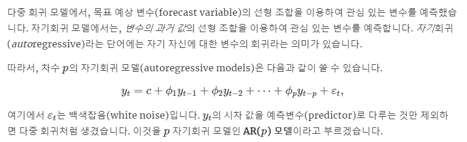
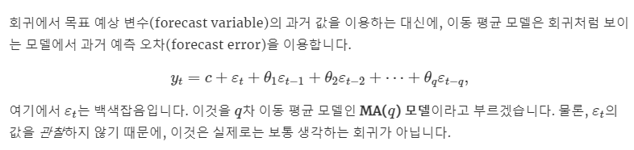
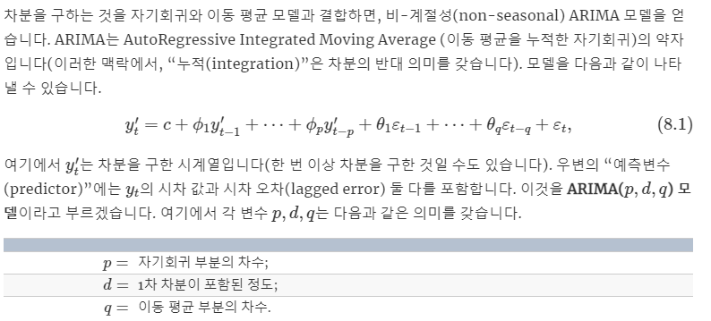
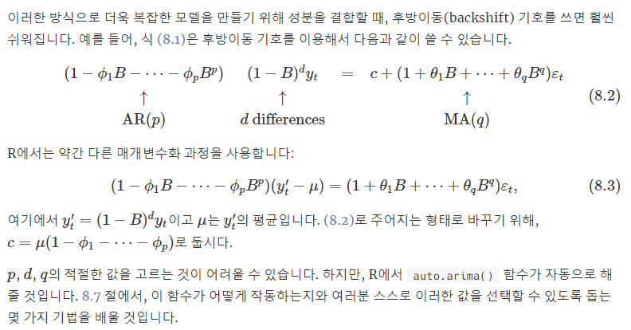
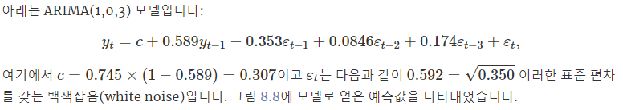
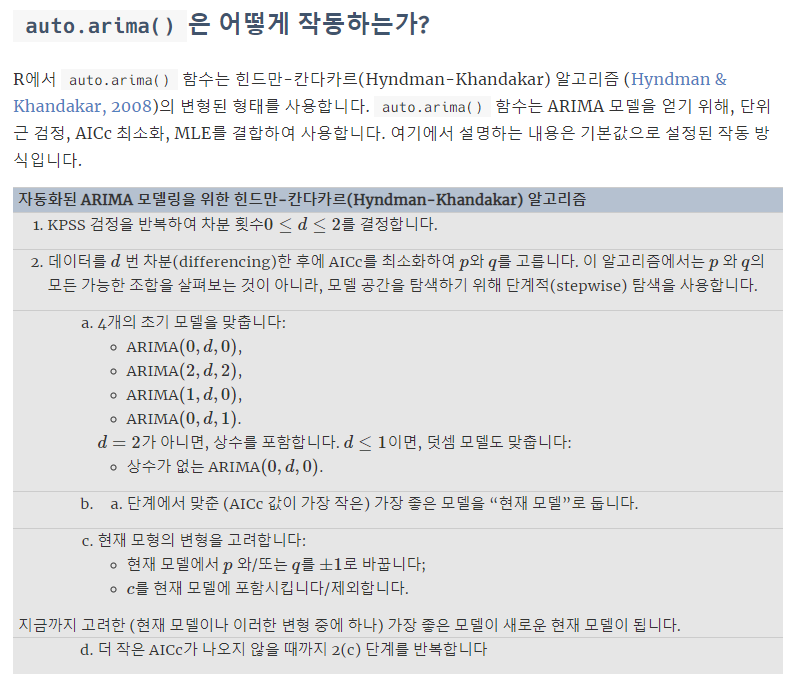
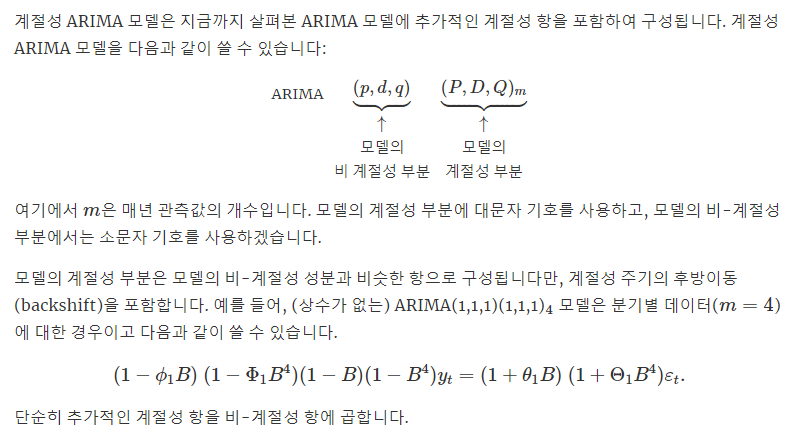

# 정상 시계열
- 추세성, 계절성, 순환성이 보이지 않는다.
- 자료 변화의 폭이 일정하다.
- 시간에 따라 상이한 자기 상관적 패턴을 나타내는 구간이 없다.

# 비정상 판단
- ACF 가 매우 
# 정상화
- 차분
  - 1차 차분 
  - 2차 이상의 차분은 거의 하지 않는다.(큰 효과가 없고, 모델만 복잡해지기 떄문)
  - 계절 차분
    - m 이 계절 주기라고 하자. 그러면 y_(t+m) - y_t 의 변환을 계절차분이라 한다.
    - 계절 차분을 실시할 경우 계절성에 의한 주기 변동이 크게 줄어든다.
  - 단위근 검정
    - 차분이 필요한지 아닌지에 대한 검정을 실시할 수 있다. 
- 변환
  - log, sqrt 등, 점점 진폭이 커지는 시계열의 경우 이러한 변환을 통해서 변화의 폭을 일정하게 해서 정상 시계열로 만들 수 있다.
  - box cox 를 이용할 수도 있다.
  
# AR 모델



- AR 모델은 이전의 관측값이 이후 자신의 관측값에 영향을 준다는 아이디어
- 자기 자신의 과거값에 기반한 변동을 추정한다.
- 하지만 과거값의 변동보다 훨씬 변동이 큰 경우 부적합

# MA 모델



- '과거값' 이 아니라 과거값이 설명하지 못한 '오차' 즉. 예측하지 못했던 변동값이 현재 항에 영향을 준다는 아이디어
- '변화' 에 더 초점을 둔 아이디어이다.

# ARIMA 모델





- 우선 ARMA 모델은 위 두 부분을 합친 모델이다. 
- 하지만 여전히 불규칙 시계열 데이터를 예측하지 못하는 단점이 있다.(기본적으로 정상 시계열을 잘 예측함)
- 그래서 차분으로, 시계열을 정상시계열로 만든 뒤에 ARMA 모델을 적용하는것이 ARIMA 모델이다.
- ARMA(AR계수,차분,MA계수)

## EX

```{r}
library(forecast)
library(fpp2)
autoplot(uschange[,"Consumption"]) +
  xlab("연도") + ylab("분기별 백분율 변화")
```

```{r}
fit <- auto.arima(uschange[,"Consumption"], seasonal=FALSE)
fit
```



- 이 때에 위의 auto.arima 가 궁금할 텐데, 



- 위와 같이 자동화 되어서 p,d,q 를 각각 조절하면서 AIC 기준으로 최적의 모델을 찾으려고 노력한다.
- 우리만의 모델을 쓰고 싶다면 Arima() 함수를 이용하면 된다.

```{r}
Arima(uschange[,"Consumption"],order=c(2,0,2))
```
- 직접 order 으로 Arima(2,0,2) 를 적용한 모습. 좀 더 AIC 가 증가한것을 볼 수 있다.

```{r}
fit %>% forecast(h=10) %>% autoplot(include=80) +
  ggtitle("0이 아닌 평균을 가지는 ARIMA(1,0,3)로부터 얻은 예측값") + ylab("소비")
```
- Fitting 한 모델을 forcast 를 통해서 예측하고, plot 으로 그린 모습

```{r}
coef(fit) # 계수
forecast(fit) # 예측
```

```{r}
checkresiduals(fit)
```

```{r}
autoplot(forecast(fit))
```

# 계절 ARIMA (SARIMA)



- 위 그림의 예시에서 y_t 앞 (1-B)(1-B^4) 의 차분은, y 를 정상 시계열로 만들기 위한 변환, 그리고 B^4 로 구성된 계절성 ARMA 와 B 로 구성된 ARMA 의 곱을 통해서 계절적회귀와 시간적 회귀 둘다 고려할 수 있게된다.
- 에러(변동) 과 과거값 의 사항을 계절성과 이전시점의 ARMA 곱을 통해서 모두 고려 가능하게 된다.

## EX
- 1996 년부터 2011 년까지 분기별 유럽 소매 거래 데이터를 이용하자.
```{r}
autoplot(euretail) + ylab("소매 지수") + xlab("연도")
```

```{r}
auto.arima(euretail)
```
- (0,1,3)(0,1,1)[4] : 계절성은 4, 계설성은MA(1),일반모형은MA(3) 차분은 각각 1번씩 임을 알 수 있다.

## EX2

```{r}
#scv 파일 읽기
data <- read.csv("Data/Timedata.csv",header=FALSE)
head(data)
```

```{r}
#-------------- 라이브러리 ---------------#
library(tseries)
library(fUnitRoots)
library(forecast)
```
- 라이브러리를 import 하자.

```{r}
#-----------------데이터 시계열 데이터로 만들기 ---------------#

# 주기를 가지는듯 하므로 주기가 12인 데이터로 만들자.
data_1 <- ts(data) # 나중에 그래프 그릴떄 필요
data<-ts(data,frequency = 12) # 월별 데이터일때, 즉 주기가 12
```
- 데이터의 주기를 12로 설정한다.

```{r}
#-----------------그래프 그려보기 ---------------#
# 계설성 확인하기 (이떄는 12)
plot(data_1,xaxt = "n")
axis(1, at = seq(12, 108, by = 12))
```

- 계절성과 추세를 나누어보자.
```{r}
# 계절성 / 추세 나누는 그래프
plot(stl(data[,1], s.window="periodic"))
```

- ACF/PACF 로 확인하기
```{r}
#------------ ACF/PACF 로 비정상 데이터임을 확인하기 ------#
acf(data,main="ACF", lag=36)
pacf(data,main="PACF", lag=36)
```
- 데이터를 보았을 때, lag 가 확 줄어드는게 아니라, 변동하면서 줄어든다.
- 비정상적임을 확인 가능

```{R}
#-----------------분산안정화----------------#
data_sqrt<-1/sqrt(data)
ts.plot(data_sqrt)
```
- 갈수록 줄어드는 그 진폭이 줄어드는 형태였기 때문에, 분산 안정화를 1/sqrt 로 시행

```{r}
#-----------------추세 정상화를 위한 차분하기-------------------#
data_sqrt_diff1 <- diff(data_sqrt, difference = 1)
data_sqrt_diff2 <- diff(data_sqrt, difference = 2)

par(mfrow=c(3,1))
plot.ts(data_sqrt)
plot.ts(data_sqrt_diff1)    # 1차차분 선정
plot.ts(data_sqrt_diff2)
```
- 차분을 진행해보앗을 때, 1차 차분으로도 어느정도 정상화가 진행되었다.
- 그러므로 1차 차분을 진행

```{r}
#------------------ 계절 차분하기 ---------------#
data_sqrt_diff1_S<-diff(data_sqrt_diff1, lag=12)
par(mfrow=c(1,1))
plot.ts(data_sqrt_diff1_S)
```
- 계절성이 12일 마다 있었기 때문에 계절차분을 진행하였다.


```{r}
#--------- 정상시계열로 변환되었는지 확인하기 ------#
adfTest(data_sqrt_diff1_S) # adf test 
pp.test(data_sqrt_diff1_S)
```
- adf,pp test 의 결과 둘다 정상시계열임을 알 수 있었다.

```{r}
#----------- 최종 데이터 변환(예비모델 생성) --------#
data_1 <- data_sqrt_diff1_S

#------------- acf / pacf -------------------------#
par(mfrow=c(1,1))
acf(data_1,main="ACF", lag=36)
pacf(data_1,main="PACF", lag=36)
```
- 어느정도 안정된거 같기도 하다.


```{r}
#-------------auto arima 적용--------------------#
# 위 acf/ pacf 를 보고 ar/ma 추정할때 참고.
auto.arima(data_sqrt)
```
- Auto armima 를 통해 어떠한 Arima 모델을 써야하는지 알 수 있다.
- 이 떄에 선정 기준은 AIC 이다. 

```{r}
#--------------- 모형 적합하기 -------------------#
# 예비모델 생성했을 시 FIT 이 많아진다.
#SARIMA(0,1,1)x(0,1,1) MODEL
fit<-Arima(data_sqrt,c(0,1,1), seasonal=list(order=c(0,1,1),period=12))
fit
```
```{r}
#----------------모델의 진단--------------------#
tsdiag(fit)
#1. 표준화된 잔차가 -3~3 정도면 괜찮다.
#2 ACF 는 독립이여야하니까 0을 제외하고 다 0boundary 안에 있어야 한다.
#3 P-VALUE 계산시 모두 0.05 이상이다
#-> 즉 선택해도 상관 없겠네~
```

```{r}
#-------------- 모델의 예측 -----------------#
#원데이터의에 대한 12개의 예측치를 예측
pred<-predict(fit, n.ahead=12)
predict(fit, n.ahead=12)
pred
x<-1/(pred$pred)^2
answer<-c(x)
answer

par(mfrow=c(1,1))
ts.plot(data, 1/(pred$pred)^2, lty=c(1,3))
#----------------- 최종값 ------------------#
answer
```


## EX3
```{r}
# Consider the qcement data beginning in 1988
cement <- window(qcement, start=1988)
# Use 20 years of the qcement data beginning in 1988
train <- window(cement, end=c(2007,4))
fit.arima <- auto.arima(train)
fit.arima
checkresiduals(fit.arima)
```


```{r}
(fit.ets <- ets(train))
checkresiduals(fit.ets)
```

```{r}
a1 <- fit.arima %>% forecast(h = 4*(2013-2007)+1) %>%
  accuracy(qcement)
a1
```
- arima 의 추정에 대한 accuracy

```{r}
a2 <- fit.ets %>% forecast(h = 4*(2013-2007)+1) %>%
  accuracy(qcement)
a2
```
- ets 추정에 따른 accuracy
- ets 가 test 에 대해서 좀 더 좋아보인다?

```{r}
cement %>% ets() %>% forecast(h=12) %>% autoplot()
cement %>% auto.arima() %>% forecast(h=12) %>% autoplot()
```
- ETS 와 Auto arima 의 추정을 서로 비교해 볼 수 있다.
