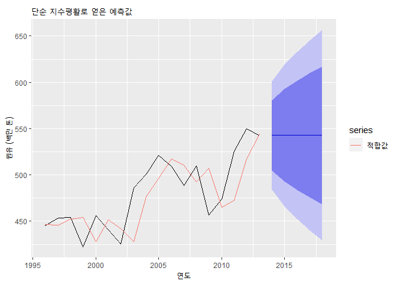
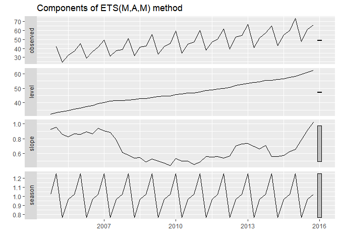
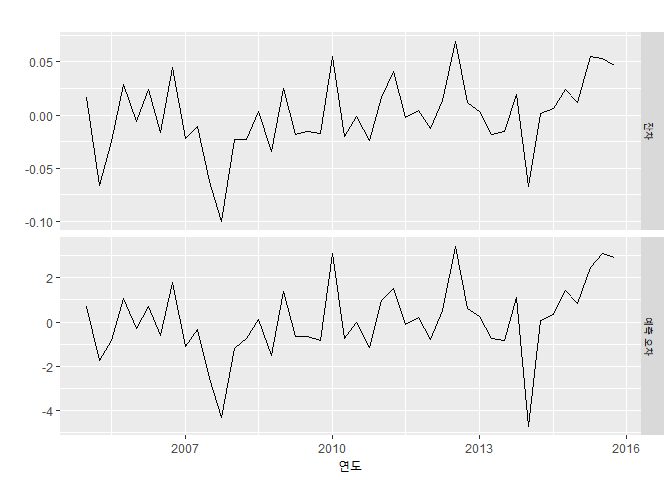
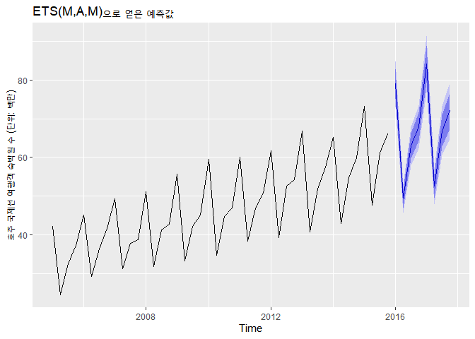

Untitled
================

# 단순지수 평활법


  - 위처럼 지수의 형태로 이전 관측치를 이용해 다음 관측치를 예측하게 된다.
  - a 는 0\~1 사이의 값으로, a 가 1에 가까울수록 최근의 추세를 많이 반영하고 변화에 민감하다.
  - a 가 0 에 가까울수록 과거 시점의 영향을 많이 받는다.


  - 위처럼 SSE 를 최소화 하게 a 를 구한다.
  - 이 때 회귀모델과는 다르게, 최적화 문제가 비선형이고 이는 최적화 Algotithm 을 따로 구해야함을 볼 수 있다.
  - 사실 이전 값들의 지수 비율로 값을 누적해 구하기 때문에 경향을 따라가는것이 느리다.
  - 이전의 값들을 고려해서 뒤에 채운다는 의미로, 크게 의미있는 모델은 아니다.

## Analysis

  - 시계열 그래프의 첫 단계는 무조건 그래프를 그려보는것이다.
  - 그를 통해서 어떤 모델이 적합할지 생각해볼 수 있다.

<!-- end list -->

``` r
library("forecast")
library('fpp2')
oildata <- window(oil, start=1996)
fc <- ses(oildata, h=5) # 총 5개의 미래값 예측
round(accuracy(fc),2)
```

    ##               ME  RMSE   MAE MPE MAPE MASE  ACF1
    ## Training set 6.4 28.12 22.26 1.1 4.61 0.93 -0.03

  - 단순지수평활이라서 확실히 변화에 느리다.

<!-- end list -->

``` r
autoplot(fc) +
  autolayer(fitted(fc), series="적합값") +
  ylab("원유 (백만 톤)") + xlab("연도") +
  ggtitle("단순 지수평활로 얻은 예측값")
```

<!-- -->

# 이중 지수평활(홀트의 선형 추세 기법)


  - 시계열에 추세가 있는경우 적합
  - Forecast equation 을 보면 알 수 있듯이, h 시점 이후의 예측은 b\_t 라는 기울기 추정 과 l\_t
    라는 t 시점의 시계열 추정값으로 구성된 선형 추정이다.
  - 즉 시계열은 에러가 있을지언정, 근본적으로 ‘선형’ 이라는 가정을 한다.
  - 평활 매개변수인 alpha,beta,l\_0,b\_0 은 아래와 똑같이 한 단계 학습 오차에 대한 SSE 를 최소화 하여
    추정

 \#\#
Analysis

``` r
air <- window(ausair, start=1990)
fc <- holt(air, h=15)
fc
```

    ##      Point Forecast    Lo 80     Hi 80    Lo 95     Hi 95
    ## 2017       74.60130 71.57106  77.63154 69.96695  79.23566
    ## 2018       76.70304 72.76440  80.64169 70.67941  82.72668
    ## 2019       78.80478 74.13092  83.47864 71.65673  85.95284
    ## 2020       80.90652 75.59817  86.21487 72.78810  89.02494
    ## 2021       83.00826 77.13343  88.88310 74.02348  91.99305
    ## 2022       85.11000 78.71857  91.50143 75.33516  94.88485
    ## 2023       87.21174 80.34235  94.08113 76.70591  97.71757
    ## 2024       89.31348 81.99718  96.62978 78.12417 100.50280
    ## 2025       91.41522 83.67768  99.15276 79.58168 103.24876
    ## 2026       93.51696 85.37987 101.65405 81.07236 105.96157
    ## 2027       95.61870 87.10069 104.13671 82.59153 108.64587
    ## 2028       97.72044 88.83774 106.60314 84.13553 111.30535
    ## 2029       99.82218 90.58911 109.05525 85.70141 113.94295
    ## 2030      101.92392 92.35321 111.49463 87.28678 116.56106
    ## 2031      104.02566 94.12874 113.92257 88.88964 119.16168

``` r
# holt 의 방법을 air 라는 data 에 적용
# 총 5개(h) 의 미래값을 예측한다.
```

# 감쇠 추세 기법(Damped trend)

  - 사실 홀트의 선형 기법은 미래에도 계속 일정한 추세를 나타낸다.
  - 하지만 예측하는 시점이 멀수록, 그 효과가 떨어져야 정상일 것이다.
  - 그러므로 감쇠추세 기법은 아래와 같이 h 가 아니라 pi 의 거듭제곱의 합으로 modeling


  - a,b 외에도 pi 변수가 있음을 기억하자.
  - pi 변수도 위와 같이 추정되는 변수이다.

## Analysis

``` r
fc2 <- holt(air, damped=TRUE, phi = 0.9, h=15)
# phi 를 지정해주면, 그 값을 쓰게된다.
fc2
```

    ##      Point Forecast    Lo 80     Hi 80    Lo 95     Hi 95
    ## 2017       73.71036 70.35724  77.06348 68.58220  78.83852
    ## 2018       75.02175 70.30251  79.74098 67.80430  82.23919
    ## 2019       76.20199 70.01113  82.39285 66.73389  85.67010
    ## 2020       77.26421 69.53683  84.99160 65.44620  89.08223
    ## 2021       78.22021 68.91713  87.52330 63.99237  92.44806
    ## 2022       79.08061 68.18039  89.98084 62.41016  95.75107
    ## 2023       79.85497 67.34900  92.36095 60.72874  98.98121
    ## 2024       80.55190 66.44106  94.66274 58.97123 102.13257
    ## 2025       81.17913 65.47143  96.88683 57.15628 105.20198
    ## 2026       81.74364 64.45247  99.03480 55.29908 108.18820
    ## 2027       82.25170 63.39448 101.10891 53.41207 111.09132
    ## 2028       82.70895 62.30612 103.11178 51.50551 113.91238
    ## 2029       83.12047 61.19467 105.04628 49.58785 116.65310
    ## 2030       83.49085 60.06628 106.91541 47.66607 119.31563
    ## 2031       83.82418 58.92614 108.72223 45.74592 121.90245

``` r
fc <- holt(air, h=15)
fc2 <- holt(air, damped=TRUE, h=15)
autoplot(air) +
  autolayer(fc, series="홀트 기법", PI=FALSE) +
  autolayer(fc2, series="감쇠 홀트 기법", PI=FALSE) +
  ggtitle("홀트 기법으로 얻은 예측값") + xlab("연도") +
  ylab("호주 항공객 (백만 명)") +
  guides(colour=guide_legend(title="예측값"))
```

<!-- -->

# 계절지수 평활법(additive)

  - 추세, 계절성이 함께 있는 시계열에 적합
  - 시간에 따른 계절적 진폭의 크기가 일정할 때 사용한다.
  - 예측값 = 추세 + 계절(일정) + 에러 로 예측


# 계절지수 평활법(multiplicative)

  - 추세 계절성이 함께 있고, 졔절적 진폭의 크기가 시계열의 수준에 비례하게 변할 때 사용
  - 예측값 = 추세\*계절 + 에러


# ETS 모델 (상태 공간 모델)

  - 오차, 추세, 계절성에 대해 각 상태 공간 모델을 구분하는 모델을 짤 수 있다.
  - t-1 시점의 오차를 다음 t 시점에 더해주는 모델 : 덧셈오차모델
  - t-1 시점의 오차를 상대적인 비율로 다음 t 시점에 더해주는모델 : 곱셈오차모겔

.png)

.png)


## Analysis

### ets

  - R 의 forcast 패키지의 ets 함수를 이용하여 모델을 추정할 수 있다.

  - ses,holt 등의 함수와는 달리 예측값을 내지는 않으나, 모델의 매개변수를 추정하고, 맞춘 모델에 대한 정보를
    돌려준다.

  - ets(y, model=“ZZZ”, damped=NULL, alpha=NULL, beta=NULL, gamma=NULL,
    phi=NULL, lambda=NULL, biasadj=FALSE, additive.only=FALSE,
    restrict=TRUE, allow.multiplicative.trend=FALSE)
    
      - model : 추정할 모델을 ETS 분류로 나타내는 3자리 코드, “N”은 없다는 것을, “A”는 덧셈, “M”은
        곱셈, 또는 “Z”는 자동으로 선택하는 것을 의미합니다. 각 입력값을 “Z”로 두면 정보 기준에 따라 성분을
        선택합니다. 기본 설정값 ZZZ는 모든 성분을 정보 기준에 따라 선택하는 것을 의미합니다.
      - damp : 만약에 damped=TRUE이면, 감쇠 추세 (A나 M 중에서 하나)를 사용할 것입니다.
        damped=FALSE이면, 비-감쇠 추세를 사용할 것입니다. damped=NULL(기본 설정값), 어떤 모델이
        가장 낮은 정보 기준 값을 갖는지에 따라 감쇠와 비-감쇠 추세 중에서 하나를 선택할 것입니다.
      - alpha,beta,gamma,phi : 평활 매개변수의 값은 이러한 입력값을 이용하여 구체적으로 정할 수
        있습니다. 만약에 이러한 값을 NULL로 두면(각각에 대한 기본 설정값), 매개변수를 추정합니다.
      - lambda : 박스-칵스(Box-Cox) 변환 매개변수. lambda=NULL이면(기본 설정값), 이 항목은
        무시됩니다. 그렇지 않으면, 모델을 추정하기 전에, 시계열이 변환될 것입니다. lambda가 NULL이
        아닐 때는, additive.only가 TRUE로 정해집니다.
      - allow.multiplicative.trend : 곱셈 추세 모델도 사용할 수 있습니다만 이러한 모델을 고려하도록
        하려면 이 입력을 TRUE로 두시길 바랍니다.

  - ets 객체
    
      - coef() : 맞춘 매개변수 전부를 돌려줌
      - acccuracy : 맞춘 매개변수 전부를 돌려줌
      - summary() : 요약정보
      - autoplot : 성분의 시간그래프 그림
      - residuals : 추정 모델에서 잔차를 돌려줌
      - fitted : 학습 데이터에 대한 한단계 예측값을 돌려줌
      - simulate : 적합 모델에서 미래 표본 경로를 모사
      - forcast : 예측값과 예측 구간 계산

<!-- end list -->

``` r
aust <- window(austourists, start=2005)
fit <- ets(aust)
summary(fit)
```

    ## ETS(M,A,M) 
    ## 
    ## Call:
    ##  ets(y = aust) 
    ## 
    ##   Smoothing parameters:
    ##     alpha = 0.1908 
    ##     beta  = 0.0392 
    ##     gamma = 2e-04 
    ## 
    ##   Initial states:
    ##     l = 32.3679 
    ##     b = 0.9281 
    ##     s = 1.0218 0.9628 0.7683 1.2471
    ## 
    ##   sigma:  0.0383
    ## 
    ##      AIC     AICc      BIC 
    ## 224.8628 230.1569 240.9205 
    ## 
    ## Training set error measures:
    ##                      ME     RMSE     MAE        MPE     MAPE     MASE      ACF1
    ## Training set 0.04836907 1.670893 1.24954 -0.1845609 2.692849 0.409454 0.2005962

  - 추정된 모델은 ETS(M,A,M) 임을 알 수 있다.
  - 이에 따라 추정된 계수들을 볼 수 있다.

<!-- end list -->

``` r
autoplot(fit)
```

<!-- -->

``` r
cbind('잔차' = residuals(fit),
      '예측 오차' = residuals(fit, type='response')) %>%
  autoplot(facet=TRUE) + xlab("연도") + ylab("")
```

<!-- --> - 잔차와
예측오차는 다르다. (잔차는 epsilon 으로, 곱셈 오차로 주어지기 때문) - residual 을 response
로 두게 되면, 예측 오차를 예산 가능

``` r
fit %>% forecast(h=8) %>%
  autoplot() +
  ylab("호주 국제선 여행객 숙박일 수 (단위: 백만)") +
  ggtitle("ETS(M,A,M)으로 얻은 예측값")
```

<!-- -->

### forcast

  - 아래는 ets 모델을 적용했을떄, 이 함수가 지원하는 것들이다.
  - forecast(object, h=ifelse(object\(m>1, 2*object\)m, 10),
    level=c(80,95), fan=FALSE, simulate=FALSE, bootstrap=FALSE,
    npaths=5000, PI=TRUE, lambda=object$lambda, biasadj=NULL, …)
  - object : ets 함수가 돌려주는 객체
  - h : 예측 범위(예측할 기간의 개수)
  - level : 예측 구간에 대한 신뢰 수준
  - fan : fan=TRUE이면, level=seq(50,99,by=1)입니다. 부채 그래프(fan plot 또는 fan
    chart)의 경우에 알맞습니다.
  - simulate : simulate=TRUE이면, 대수적인 식을 사용하는 대신에, 모사하여 예측 구간을 돌려줍니다.
    simulate=FALSE이더라도, 특정 모델에 대해 사용할 수 있는 대수적인 식이 없는 경우라면, 모사를 할 것입니다.
  - bootstrap : 만약에 bootstrap=TRUE이고 simulate=TRUE이면, 정규 분포를 이루는 오차 대신,
    모사한 예측 구간에서 다시 뽑아서 만든 오차를 사용합니다.
  - npaths :모사 예측 구간을 계산할 때 사용하는 표본 경로의 수.
  - PI : 만약에 PI=TRUE이면, 예측 구간을 그립니다; 그렇지 않은 경우에는 점 예측치만 계산합니다.
  - lambda : 박스-칵스(Box-Cox) 변환 매개변수. 만약에 lambda=NULL이면, 이 항목이 무시됩니다. 그렇지
    않은 경우에는, 예측값이 역 박스-칵스(Box-Cox) 변환을 통해 역 변환됩니다.
  - biasadj :만약에 lambda가 NULL이 아니면, 역 변환된 예측값이 (그리고 예측 구간이) 편향에 대해
    조정됩니다.

# Reference

  - <https://otexts.com/fppkr/>
