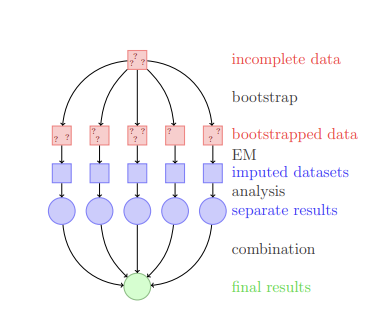
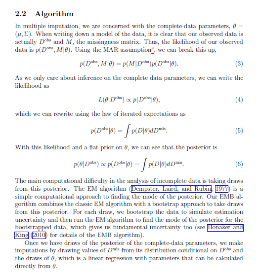

```{r setup, include=FALSE}
knitr::opts_chunk$set(warning=FALSE, message=FALSE)
```
- 결측치가 존재하게 되면 R 에서는계산도 하지 않게 될 뿐더러 많은 통계패키지를 적용할 수 없다. <br>
- hair et al.(2006) 에 의하면 결측치 비율에 따라 추천하는 처리 방법이 있다.
  - 10% 미만 : 제거, 어떠한 방법이든지 상관없음
  - 10~20% : hot deck, regression, Model based
  - 20% 이상 : model based method, regression
- Missing value는 3가지가 존재하는데 
  - Missing comlpletely at random(MCAR) : 동전던지기 처럼 완전한 랜덤
  - Missing at random(MAR) : missing data 가 observed data 에 depend 하지만 non observed 데이터에는 의존하지 않음 
  - Missing not at random(MNAR) : Non-ignorable missing 으로서 not observed,observed data 에 depend 하는 missing 데이터
- 이 때에 Missing 이 MAR 이면, 데이터로부터 효율적인 Imputation 이 가능하겠지만 MNAR 의 경우 처리하기가 쉽지 않다.
- 통계적 방법을 쓰려면 ignorable(MCAR,MAR) 이라 가정하고 하는 경우가 많다. (그러면 식이 단순해짐)
- NA 를 처리하는 방법은 매우 많다. 
  - 통계적 분포를 가정한 뒤 EM 알고리즘이나, Mice 패키지 등을 사용해서 대체할 수 있다.
  - KNN 방법을 쓸 수 있다.
      - 이 때 variable 이 많게되면 그 성능에 문제가 있게된다. 
      - 그래서 FA, PCA 등으로 Dimension reduction 이후에 진행하기도 한다.
  - CIA 가정으로 Regression 을 쓸 수 있다.
      - CIA 가정이란, conditional indipendence assumption 으로서, 예를 들어 변수 X,Y,Z가 있다고 하자. 그리고 Y,Z 에 NA가 섞여 있다고 하자.
      - 세 변수는 완벽히 독립은 아닐것이다.(실제 데이터가 그렇듯) 하지만 (Y|X)ㅛ(Z|X) 가 보장된다면(CIA 가정) X 의 데이터만으로 Y에 Regression 을 적합시켜서 Z 값 없이 Y 의 NA를 채울 수 있을것이다.
      - 위 가정은 Test 할 수 없다는게 단점이다. 현실적인 Insight 에 합리적이 되게 CIA 가정을 이용해야 할 것이다.

- Na 를 채우려면 우선 다음과 같은 고려를 해야할 것이다.
  - 모을수 있는 데이터는 모두 모은다.
    - ex) 지하철 승하차 인원이 2015년 1~4월 이 NA 라 하자. 그에 반해 버스 승차하 인원은 2015년 1~9월 데이터만 있다고 하자. 그렇다면 둘이 비슷한 성질을 가짐을 이용해서 지하철 승하차 인원을 버스 승하차 인원을 이용해 채울 수 있을것 
  - Variable 끼리 어떤 관계가 있는지 충분한 사전지식을 수집한다.
    - 예로 BMI 는 Weight/height^2 이다. 이는 BMI 는 키와 몸무게로 채울 수 있는 변수임을 알 수 있다. 
  - 충분한 EDA 를 통해서 규칙을 발견해라.
    - 예를들어 차의 2000년,2001년 평점이 NA 라 하자. EDA 를 통해서 브랜드의 '종류' 에 따라 평점이 비슷하다는 결과가 나오면, 브랜드별로 Grouping 한 뒤에 NA 를 채울 수 있을것이다.
    


# Built in 함수
먼저 매우 기초적인 방법들을 살펴보자.

## 결측치 살펴보기
```{r}
load(file = "./Data/acs.rda")
library('MASS')

#summary : summary 를 해도 NA 의 수를 모두 나타내준다.
summary(acs)

#is.na() # TRUE/FLASE 로 모두 나타내준다
head(is.na(acs))

#sum(is.na()) : 곁측값이 총 몇개인지 게산
sum(is.na(Cars93)) # 곁측값이 총 몇개인지 게산

#colSums(is.na()) : colsum 으로 각 데이터의 col 의 곁측치 계산
colSums(is.na(Cars93))
```
## 결측치 제외 및 제거
```{r}
#na.rm=TRUE : 곁측값을 통계분석시 제외 
sum(Cars93$Luggage.room) # 곁측값이 있으면 분석이 안된다.
sum(Cars93$Luggage.room, na.rm=TRUE) # 곁측값 있어도 통계분석 가능

#na.omit() : 곁측값이 들어있는 행을 분석에서 제외
Cars93_new <-na.omit(Cars93)
sum(is.na(Cars93_new)) # 곁측값이 없어진것을 볼 수 있다.
# 아래 작업을 통해서 곁측치 제거 후 row 들의 index 를 초기화 할 수 있다.
row.names(Cars93_new) <- NULL
tail(Cars93_new)

#complete.cases() : 특정행과 열에 결측값이 들어있는 행을 데이터셋에서 제거
new<-Cars93[complete.cases
          (Cars93[ ,c('Rear.seat.room')]) , ] # Cars93 데이터 프레임의 Rear.seat.room 칼럼 내 결측값이 있는 행 전체 삭제
dim(Cars93)
dim(new) # rear seat room 에서 NA 값이였던 2개의 관측치가 없어져서 row 가 2 줄었다. 
```
## 결측치 대체
```{r}
#data$col[is.na(data$col)] <- 새로운값 : 새로운값으로 col 의 곁측치 대체
mean<-mean(Cars93$Luggage.room, na.rm=TRUE) # 곁측값 미포함한 col 의 mean
Cars93$Luggage.room[is.na(Cars93$Luggage.room)] <- mean #mean 으로 대체

#sapply(data, functio(x){ifelse}(is.na(x), 대체하고픈값, x )) # 모든 col 에 대해 새로운 값으로 col 곁측치 대체 
df_imputed = sapply(Cars93, function(x){ifelse(is.na(x), mean(x, na.rm=TRUE), x)}) #sapply라 각 col 의 mean 으로 대체된다.
head(df_imputed)
```

# NA 시각화

## NA 의 Variable 별 수
Na 를 APPLY 함수를 써서 column 만 보려고 한다. <br>
이때 is.na 로 na 가 있을때에는 True 를 출력하게 한 다음 sum 을 하는 function 을 만든다.
```{r}
load(file = "./Data/acs.rda")
na.count=apply(acs,2,function(x) sum(is.na(x)))
na.count[na.count>0]
barplot(na.count[na.count>0])
```

## NA 패턴분석
```{r}
require(VIM)
aggr(acs,prop=FALSE,numbers=TRUE,cex.axis=0.8)
```

패턴을 보아 하니 EF 단독으로 NA 가 있는 경우가 많고, 그 다음에 EF,Height,Weight,Bmi 가 공란인 경우도 많았다. 아마 기초적인 검사를 한꺼번에(키,몸무게) 하지 않은듯 하다. <br>

## NA 산점도 분석
- 아래의 경우는 EF와 BMI 의 경우에 Missing 이 어떻게 분포되어있는지를 보여준다. <br>
- 회색 점들은 관측된 데이터이다. <br>
- 빨간색 점들은 Missing 이 '발생하였을 떄' EF, BMI 값들은 어떤 값이였는지를 알려주는 것이다. 

```{r}
marginplot(acs[c("BMI","age")],pch=20,col=c("darkgray","red","blue"))
```

- BMI 에 대해서 Missing 이 발생하였을 떄, age 의 분포는 나이가 든 사람이 많아보였다는것이다. <br>
- 즉 나이가 든 사람은 BMI 의 측정을 싫어한다?(정말 조약한 논리지만) 이라고도 볼 수 있다. 
- 그리고 BMI 왼편에 있는 숫자는, BMI 에 대해서 얼마나 많은 NA 가 발생하였는지를 알려준다.
```{r}
marginplot(acs[c('EF',"BMI")],pch=20,col=c("darkgray","red","blue"))
```

- 이 경우는 BMI 와 EF 의 조합이 총 59번 Missing 이 일어났다는 것이다. <br>
- EF 가 Missing 인 경우 BMI 는 높은쪽이 많았다. 즉 비만인 사람이 EF 측정을 싫어한다고 볼 수 있다.

## 누락된 자료의 상관관계
누락된 자료일 경우 1 을 넣고, 그렇지 않은 경우 0 을 넣은 뒤 상관계수를 볼 수 있다. <br>
상관계수를 보고 난 뒤에, Mssing 끼리 어떤 관계가 있는지 추측 가능하다.
```{r}
x=as.data.frame(abs(is.na(acs)))
y=apply(x,2,function(x) sum(x)>0)
round(cor(x[y]),2)
library(corrplot)
corrplot(cor(x[y]), method = "color", addCoef.col="grey", order = "AOE")
```

- BMI , Height, Weight 는 상관관계가 거의 1이다. 
- LDLC , TC, HDLC, TG 끼리는 거의 상관관계가 1이다.
- 이는 BMI = Weight / Height^2 공식과 LDLC = TC-HDLC-TG/5 공식 때문에, 이미 데이터 제공 측에서 어느정도 계산을 해서 채워넣은듯 하다. 

# NA Analysis 의 종류 
- Listwise deletion(Complete-case analysis) : 모든 변수들이 다 채워진 관측치만 이용해서 분석을 진행
  - 한개라도 누락이 있는 자료는 제거한다. 
  - 많은 통계 프로그램에서 default 로 되어있는 방법이다.
  - 그래서 NA 분석을 하지 않고 바로 Analysis 를 진행할 경우 NA 가 있다는 사실조차 까먹을 수 있음
- pairwise deletion : NA 값이 있는 관측치를 모두 제거하는것이 아니라 방법에 따라 각 쌍의 변수들에 대해 누락된 자료만을 제거

```{r}
acs_listwise=na.omit(acs) ; dim(acs_listwise) # 677개
acs_pairwise=na.omit(acs[c('EF','BMI')]) ; dim(acs_pairwise) # 689개
# lm 의 경우 pairwise 를 default 로 한다는것을 볼 수 있다.
summary(lm(EF~BMI,data=acs))
summary(lm(EF~BMI,data=acs_listwise))
summary(lm(EF~BMI,data=acs_pairwise))
```
**Listwise**

- Listwise deletion은 자료가 MCAR 인 것을 전제로 한다. 즉, complete observation이 전체 데이터의 random subsample임을 전제로 한다. 
- 우리가 listwise deletion을 한다는 것은 677명의 환자 데이터가 전체 857명의 데이터의 random subsample임을 전제한다. 
- MCAR 가정이 흔들리는 정도에 따라 회귀분석의 계수는 편향되어 나타나게 된다(biased).
  - ex) 설문조사에서 정치성향 조사란에 보수 성향의 사람들은 공란으로 남기는 경향이 크다. 이는 데이터가 MACR 이 아니라 MAR 또는 MNAR 이라는 의미로서 이 NA를 모두 제거한다면 보수성향의 사람을 대부분 제외하는것이므로 편향이 나타날 수 있다는것
- 또한 누락된 값이 있는 모든 관측치를 제거함으로써 sample size가 줄어들기 때문에 통계의 검정력(power)이 줄어들게 된다. 이 모형에서는 listwise deletion을 통해 sample size가 21% 줄어들었다.

**Pairwise**

- pairwise 는 통계량 계산에 필요한 variable 이 채워져 있으면 그냥 사용한다.
```{r}
round(cor(acs[c("EF","BMI","LDLC")],use="pairwise.complete.obs"),3)
```
-  EF는 모두 134 개가 누락되어 있고 BMI는 93, LDLC는 24, 의 누락이 있다 그러므로 EF-BMI의 분석에는 688 개, EF-LDLC의 분석에는 707 개가 사용되었고 BMI-LDLC의 분석에는 750 개가 사용되었다.
- 이는 분석가능한 모든 데이터를 사용한다는 장점이 있지만 결정적으로 분석의 Sample space 가 각기 다르기 때문에 분석 결과를 통합해서 해석하기가 어렵다. 

# KNN imputation
- KNN 은 매우 간단한 알고리즘이다. Acol 이 NA가 있는 데이터 에 대해, Acol 이 채워져 있는 데이터 중 '비슷한' k 개의 데이터를 찾는다. 그 데이터들에 대해 k 개의 Acol 의 값을 평균내서 NA 로 사용
- 비모수적(통계모형이 아닌) 방법론이며 구현이 매우 쉽다.
- 하지만 Data structure 를 고려하지 않은 Imputation 이다. 
- 변수가 많아질 경우, 그 정확도가 매우 떨어진다. 
```{R}
library(VIM)
# 임의로 NA 형성
df <- acs
df[,'smoking'][sample(1:nrow(df),50)] <- NA
# 10 개의 neighborhood 를 사용
# Categorical data 도 알아서 척척 impute 해준다.
df_imputed= kNN(df,k = 10)
head(df_imputed)
```

# Multiple imputation(mice)
**MICE**

- Multiple imputation 은 시뮬레이션을 통해서 누락된 데이터를 채워넣는다. 
  1. 먼저 imputed dataset을 여러개 만든다. (pluasible 한)
       - 이떄 각 데이터는 우리가 정한 imputed 모델을 Gibbs sampling 을 통해 근사한 뒤 그 모델에서 만들어진다.
  2. 각자의 dataset 에서 각종 통계분석을 시행
  3. 각 imputed data set 에서 별도로 분석한 결과를 pooling 한다.
- Practical Steps
  1. Missing data 의 패턴 분석
  2. Imputation 형성
       - Mice 의 장점은 연속변수,범주형 변수를 자동으로 인식하여 적절한 imputation method 를 사용
  3. Diagnostic check
      - convergence 여부 체크
  4. imputed dataset 에서 impausibla 한 값 제거
      - 남자가 임신한 데이터라든지, 4살이 결혼한 경우 등...
  5. Analysis 와 Pooling
- 고려해야 할 사항
  1. MAR assumption 이 충족되는지?
      - 관측하지 못했던 변수에 NA 가 Depend 하는 MNAR 의 상황이 존재할 수 있다. 이런 경우 현제 데이터로만 NA 를 채우는 방법을 쓰게 된다면 MAR 을 가정하고 채우는 것으로, MNAR 상황에서는 부적절한 방법일 것이다.
  2. imputation 을 수행하기 위한 predictor 결정
      - 즉 얼마나 많은 주변 변수를 이용해 na 가 있는 변수를 채워야 하는지에 대한것.
      - 많으면 많을수록 좋다고는 하는데, computational 적인 문제 등이 있어 15~25개 정도면 충분하다고 한다.(van Buuren)
  3. 어떤 순서로 imputation 을 해야할까?
      - Mice 는 기본적으로 왼쪽부터 오른쪽으로 imputation 을 한다.
      - 문제가 되는 이유는 NA 를 채워야 하는 변수는 동시에 predictor 도 되기때문에 다른 변수의 NA 를 채울때 영향을 주기 때문.
  4. Imputed dataset 은 몇개?
      - 5개 ~ 10개를 쓰는듯..
  5. 어떤 imputation model 을 써야할까?
      - 결국 synthetic data 를 형성할 때에, gibs sampling 을 사용하기 때문에, conditional 의 분포가 어떤지에 대한 가정이 필요하게 된다. mice 는 그러한 모델의 선택을 사용자에게 맡기고 있다.       - 즉 분포를 사용자가 정의해 주어야 한다는 것이다. 
      - 정의해준 분포의 모수,data를 gibs sampling 을 이용하려 joint distribution 을 생성(근사)하고, 생성한 joint distribution 을 이용하여 NA 를 채우게 된다.
- imputation model
  - Non-parametric   
      - ctree,cart : tree 모델 (class,reg 모두 가능. 즉 any data type 에 가능)
  - Parametric
      - norm : normal linear regression (numeric 에 가능)
      - normrank : Normal linear regression preserving the marginal distribution
      - logreg : Logistic regression (0,1)
      - polyreg : polytomous(multinomial) logistic regression (Factor>2 level)
      - polr : Ordered polytomous logistic regression(Ordered > 2 level)
      - pmm : Predictive mean matching (nemeric)
          - f(y|....) 을 이용해 hat(y) 를 imputation 했다고 하자. 이 값을 그대로 사용하는게 아니라 oberserved 된 애들 중 hat(y) 와 가장 가까운 녀석을 사용.
      - 이 밖에 매우 방법이 많다. ?mice 를 통해서 어떤 method 가 가능한지 살펴보자.

**how to ?**
```{r}
#require(mice) 
#imp <- mice(mydata,m)     # dataset을 m개 만든다. 디폴트는 5 
#fit <- with(imp,analysis) # analysis는 lm(), glm() 등의 통계모델이 들어간다.
#pooled <- pool(fit)       # pooled 는 m개의 분석결과의 평균 (분산은 약간 다르게 계산됨)
#summary(pooled)
```
    
## iris 데이터 example

우선 NA 를 형성하기 전에, 전체 데이터를 이용해 회귀분석을 시행해 보자.
```{r}
data(iris)            
fit=lm(Sepal.Length~Petal.Length+Species,data=iris) 
summary(fit)
```

이제 누락시킬 데이터를 살펴보자. 
```{r}
iris_NA=iris                           # 누락시킬 데이터셋 만듦
set.seed(131)
random1=sample(1:150,15)             # 15개의 sample 선택
random2=sample(1:5,15,replace=TRUE)  # 몇 번째 열을 누락시킬 것인지 15개 선택 
for(i in 1:15) iris_NA[random1[i],random2[i]]<-NA
iris_NA[random1,] 
```

이제 mice 를 통해서 누락한 자료들의 다중대입을 통해 데이터셋을 만든다.
```{r}
require(mice)
# printFlag : 프린트 하는 과정을 보지 않겠다는 뜻
# m = 몇개의 데이터 set 을 generating 할지
imp=mice(iris_NA,seed=131,printFlag = FALSE) 

summary(imp)
# 각각의 methods 를 보았을 때, 어떤것을 사용해서 각 변수들의 na 를 채웠는지 알려준다.

Complete_1= complete(imp,1) 
head(Complete_1)
# miss 를 채워 넣어서 만든 synth data 첫번째
```

with 을 이용하여, 완성된 5개의 자료에 대해 regression
```{r}
fit_imputed=with(imp,lm(Sepal.Length~Petal.Length+Species))
fit_imputed # imputed 된 데이터들의 m개의 각 fitting 을 보여준다. 
for (i in c(1:5)){
 print(fit_imputed$analyses[[i]]$coefficients)
}

pooled = pool(fit_imputed) # pooling 해서(평균) var, mean 값을 만든다. 
# mean 은 단순하게 1/m 을 해서 더해 더한다. 
# Var 정해진 공식을 이용하여 계산하게 된다. (Rubin's variance formula)
summary(pooled)
```

```{r}
imp
# Predictor matrix 는 각 0(NA) 를 어떤 variable 들을 이용하여 채워넣었는지를 알려준다.
# 이 떄에는 각 NA 를 나머지 모든 변수들을 사용하여서 채운것을 알 수 있다.
```

```{r}
# fit 값이 잘맞나..?
fit_deleted=lm(Sepal.Length~Petal.Length+Species,data=iris_NA) 
fit_del=summary(fit_deleted)
fit_full=summary(fit)
```

```{r}
# 지워진 데이터로 진행된 regression
fit_del$coefficients 

# Mice 로 채운 데이터로 진행된 regression
summary(pooled)

# Full data 로 진행되는 regression
fit_full$coefficients
```
생각보다 NA 를 채우는게 좋아보이지는 않는다. <br>

- NA를 지울때 완전 Random 으로 지웠기 때문에, 모든 NA 들은 MCAR 이다.
- 그러므로, NA 가 발생한 데이터를 지웠다는것은, 나머지 데이터를 완전 Random 하게 지운것과 같다.
- 즉, NA를 뺸 데이터는 Full data의 성질을 잘 나타내는 subset 이 될 수 있는것이다.
- 그러므로 NA 를 뺴고 진행한 Regression인 fit_del 이 오히려 더 좋은것이다.


# Amelia (Multiple Imputation)

- Amelia 패키지를 사용해서 NA 를 처리하는법을 알아보자. <br>
- Assumption
  - Amelia 는 모든 data 다 Multivariate Normal 을 따른다고 가정한다. 
  - 그리고 NA 는 MAR 이라고 가정한다.(이는 Mice 에서도 같음)
- Algorithm
  - MAR 과 MN 가정으로 인해 데이터를 generating 하고, 분석하기가 Mice 보다 훨씬 수월해진다.
  - bootstrap 과, EM algorithm 을 이용해 p(mu,sigma|observed data) 를 알 수 있게 되고, 그러면 mu,sigma 의 분포를 알게 되므로 missing data 를 generating 할 수 있게된다. 
  - 그리고 bootstrap 과 EM 으로 생성된 데이터를 이용해, Mice 와 같이 모겔을 각각 세운 후 , eastimates 들을 합쳐서 추정
  





- Mice 와의 비교 (https://www.analyticsvidhya.com/blog/2016/03/tutorial-powerful-packages-imputing-missing-values/)
  - MICE imputes data on variable by variable basis whereas MVN uses a joint modeling approach based on multivariate normal distribution.
  - MICE is capable of handling different types of variables whereas the variables in MVN need to be normally distributed or transformed to approximate normality.
  - Also, MICE can manage imputation of variables defined on a subset of data whereas MVN cannot.
- 즉 정리하자면, Amelia 는 MVN 가정때문에, 분포가 Normal 과 비슷할 때에 NA 처리를 잘한다. 그러므로 그에 알맞은 Transformation 을 하고 난 이후에 작동이 잘 될 것이다(사실 변환은 패키지가 어느정도 해주긴 한다. ).

## 시계열 
- freetrade 는 1980~1993년까지의 무역정책 자유화에 대한 분석 데이터이다. <br>
- 변수는 연도,국가,관세율, 정치지수(-10~10 으로 클수록 자유화),총인구,국민총생산, 총국제준비액, IMF가입년도, 재무적공개석, US선호지수 로 구성되어 있다. <br>

```{r}
library(Amelia)
data(freetrade)
summary(freetrade)
```
Regression
```{r}
summary(lm(tariff ~ polity + pop + gdp.pc + year + country, data = freetrade))
```
- 이 떄에 60개의 데이터가 지워진것을 볼 수 있다. 
- Missing 에도 정보가 있고, 또한 MACR 이 아니라 MAR 이면, 결과가 Biased 될 지도 모르는일이기 때문에 이를 꼭 잘 채워주어야 한다.
- imputation 을 수행할 때에 제일 첫 step 은 imputation 에 들어갈 변수를 찾는것이다.
- imputation 할 때에는 최대한 많은 변수를 넣는것이 좋다. 
- 그러므로 우리의 Analysis 의 주된 목적이 pop,polity,gdp.pc 에 있다 하더라도 모든 variable 을 넣어서 imputation 을 진행하겠다.
```{r}
# m : 몇개의 데이터를 생성할 것인가
# ts : 시계열에 대한 정보가 되는 열의 이름
# cs : cross-sectional 분석에 이용되는 정보 
# Note : 횡단면 데이터(Cross-Sectional Data)란 복수의 개체(기업, 지역, 지구, 피험자 등)를 어느 한 시점에서 본 관측값으로 이루어진 데이터.예를 들면 2016년 47개 행정구역의 주민 소득 데이터 등이 이에 해당.
a.out <- amelia(freetrade, m = 5, ts = "year", cs = "country")
a.out
```
- 위 dataset 은 매우 작은경우임을 명심하자.
- 일반적으로 몇백~몇천의 EM Algorithm 의 steps 를 겪는다고 한다. 
- 긴 chain length 가 나온다면, 우리 variable 이 Multi noraml 에 잘 맞지 않는다는 의미일 수 있고, 이는 variable 을 normal 에 맞게 변환시켜야 할 수도 있을것이다.

```{r}
df_imputed3 = a.out$imputations[[3]]# 3번째 imputed set 
head(df_imputed3)
```
- 3번째 imputed data set 을 출력해 보았다.

```{r}
hist(a.out$imputations[[3]]$tariff, col="grey", border="white")
```
- 3번째로 imputed 된 데이터에 대해 tariff 의 분포를 살펴보았다.
- 데이터를 이용하고 싶다면, full imputed 된 데이터 a.out$imputations[[i]] 를 이용하면 될 것이다.
- 자세한 Settings 는 (AMELIA II: A Program for Missing Data) 의 pdf 21p 를 확인해보자.

## Transformation
- As it turns out, much evidence in the literature (discussed in King et al. 2001) indicates that the multivariate normal model used in Amelia usually works well for the imputation stage even when discrete or nonnormal variables are included and when the analysis stage involves these limited dependent variable models (AMELIA II: A Program for Missing Data-16p)
  - 즉 어느정도 Normal 분포가 아니거나, discrete 이여도 잘 작동한다는 의미이다.
- Although these transformations are taken internally on these variables to better fit the data to the multivariate normal assumptions of the imputation model, all the imputations that are created will be returned in the original untransformed form of the data.
  - 즉 어느정도의 Transformation 은 자체 내장 함수가 수행해 준다는 의미이다. 

## Ordinal
- Ordinal 의 경우는 따로 처리가 필요하다.
```{r}
table(a.out$imputations[[3]]$polity)
```
위와 같이 polity 는 -10~10 의 점수를 가지는 ordinal 임에도 데이터의 imputation 이 continuous 한 형태로 나타난것을 볼 수 있다. <br>
이 자체로 써도 되긴 하지만 더 정확한 impute 를 위해 다르게 할 수도 있다 <br>

```{r}
# p2s 는 display 할지 말지, 크게 중요한 변수는 아님 
a.out1 <- amelia(freetrade, m = 5, ts = "year", cs = "country", ords ="polity", p2s = 0)
```

## Nominal(Categorical)
- signed which is 1 if a country signed an IMF agreement in that year and 0 if it did not
  - 즉 signed 라는 variable 은 1,0 의 categorical variable 이다. 
```{r}
table(a.out1$imputations[[3]]$signed)
```
그런데 conti 값으로 Categorical variable 을 채워넣은것을 볼 수 있다.

```{r}
a.out2 <- amelia(freetrade, m = 5, ts = "year", cs = "country", noms ="signed", p2s = 0)
table(a.out2$imputations[[3]]$signed)
```
위처럼 noms 를 지정해 주어야 잘 작동하는것을 볼 수 있다.

## Diagnotic
- amelia 에서는 diagnotic 이 가능하다. <br>
```{r}
# which.var : 어떤 variable 을 볼지 
# 우리가 채운 tariff, intresmi그려준다.
plot(a.out, which.vars = c('tariff','intresmi','fiveop'))
compare.density(a.out, var = "signed") # signed 의 Observed value 와 mean imputation 을 보여준다. 
summary(freetrade)
```
# 참고자료
- https://eda-ai-lab.tistory.com/14
- https://rstudio-pubs-static.s3.amazonaws.com/192402_012091b9adac42dbbd22c4d07cb00d36.html
- https://robotcat.tistory.com/469
- https://www.analyticsvidhya.com/blog/2016/03/tutorial-powerful-packages-imputing-missing-values/
- AMELIA II: A Program for Missing Data()
- mice : Multivariate Imputation by Chained Equations in R(2011)
