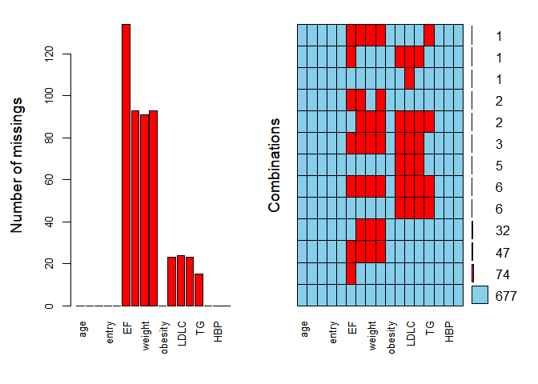

NA\_imputation
================

  - 결측치가 존재하게 되면 R 에서는계산도 하지 않게 될 뿐더러 많은 통계패키지를 적용할 수 없다. <br>
  - hair et al.(2006) 에 의하면 결측치 비율에 따라 추천하는 처리 방법이 있다.
      - 10% 미만 : 제거, 어떠한 방법이든지 상관없음
      - 10\~20% : hot deck, regression, Model based
      - 20% 이상 : model based method, regression
  - Missing value는 3가지가 존재하는데
      - Missing comlpletely at random(MCAR) : 동전던지기 처럼 완전한 랜덤
      - Missing at random(MAR) : missing data 가 observed data 에 depend
        하지만 non observed 데이터에는 의존하지 않음
      - Missing not at random(MNAR) : Non-ignorable missing 으로서 not
        observed,observed data 에 depend 하는 missing 데이터
  - 이 때에 Missing 이 MAR 이면, 데이터로부터 효율적인 Imputation 이 가능하겠지만 MNAR 의 경우
    처리하기가 쉽지 않다.
  - 통계적 방법을 쓰려면 ignorable(MCAR,MAR) 이라 가정하고 하는 경우가 많다. (그러면 식이 단순해짐)
  - NA 를 처리하는 방법은 매우 많다.
      - 통계적 분포를 가정한 뒤 EM 알고리즘이나, Mice 패키지 등을 사용해서 대체할 수 있다.
      - KNN 방법을 쓸 수 있다.
          - 이 때 variable 이 많게되면 그 성능에 문제가 있게된다.
          - 그래서 FA, PCA 등으로 Dimension reduction 이후에 진행하기도 한다.
      - CIA 가정으로 Regression 을 쓸 수 있다.
          - CIA 가정이란, conditional indipendence assumption 으로서, 예를 들어 변수
            X,Y,Z가 있다고 하자. 그리고 Y,Z 에 NA가 섞여 있다고 하자.
          - 세 변수는 완벽히 독립은 아닐것이다.(실제 데이터가 그렇듯) 하지만 (Y|X)ㅛ(Z|X) 가
            보장된다면(CIA 가정) X 의 데이터만으로 Y에 Regression 을 적합시켜서 Z 값
            없이 Y 의 NA를 채울 수 있을것이다.
          - 위 가정은 Test 할 수 없다는게 단점이다. 현실적인 Insight 에 합리적이 되게 CIA 가정을
            이용해야 할 것이다.
  - Na 를 채우려면 우선 다음과 같은 고려를 해야할 것이다.
      - 모을수 있는 데이터는 모두 모은다.
          - ex) 지하철 승하차 인원이 2015년 1\~4월 이 NA 라 하자. 그에 반해 버스 승차하 인원은
            2015년 1\~9월 데이터만 있다고 하자. 그렇다면 둘이 비슷한 성질을 가짐을 이용해서 지하철 승하차
            인원을 버스 승하차 인원을 이용해 채울 수 있을것
      - Variable 끼리 어떤 관계가 있는지 충분한 사전지식을 수집한다.
          - 예로 BMI 는 Weight/height^2 이다. 이는 BMI 는 키와 몸무게로 채울 수 있는 변수임을 알
            수 있다.
      - 충분한 EDA 를 통해서 규칙을 발견해라.
          - 예를들어 차의 2000년,2001년 평점이 NA 라 하자. EDA 를 통해서 브랜드의 ‘종류’ 에 따라
            평점이 비슷하다는 결과가 나오면, 브랜드별로 Grouping 한 뒤에 NA 를 채울 수
            있을것이다.

# Built in 함수

먼저 매우 기초적인 방법들을 살펴보자.

## 결측치 살펴보기

``` r
load(file = "./Data/acs.rda")
library('MASS')
#is.na() # TRUE/FLASE 로 모두 나타내준다
head(is.na(acs))
```

    ##        age   sex cardiogenicShock entry    Dx    EF height weight   BMI obesity
    ## [1,] FALSE FALSE            FALSE FALSE FALSE FALSE  FALSE  FALSE FALSE   FALSE
    ## [2,] FALSE FALSE            FALSE FALSE FALSE FALSE  FALSE  FALSE FALSE   FALSE
    ## [3,] FALSE FALSE            FALSE FALSE FALSE FALSE   TRUE   TRUE  TRUE   FALSE
    ## [4,] FALSE FALSE            FALSE FALSE FALSE FALSE  FALSE  FALSE FALSE   FALSE
    ## [5,] FALSE FALSE            FALSE FALSE FALSE FALSE  FALSE  FALSE FALSE   FALSE
    ## [6,] FALSE FALSE            FALSE FALSE FALSE FALSE  FALSE  FALSE FALSE   FALSE
    ##         TC  LDLC  HDLC    TG    DM   HBP smoking
    ## [1,] FALSE FALSE FALSE FALSE FALSE FALSE   FALSE
    ## [2,]  TRUE  TRUE  TRUE FALSE FALSE FALSE   FALSE
    ## [3,]  TRUE  TRUE  TRUE  TRUE FALSE FALSE   FALSE
    ## [4,] FALSE FALSE FALSE FALSE FALSE FALSE   FALSE
    ## [5,] FALSE FALSE FALSE FALSE FALSE FALSE   FALSE
    ## [6,] FALSE FALSE FALSE FALSE FALSE FALSE   FALSE

``` r
#sum(is.na()) : 곁측값이 총 몇개인지 게산
sum(is.na(Cars93)) # 곁측값이 총 몇개인지 게산
```

    ## [1] 13

``` r
#colSums(is.na()) : colsum 으로 각 데이터의 col 의 곁측치 계산
colSums(is.na(Cars93))
```

    ##       Manufacturer              Model               Type          Min.Price 
    ##                  0                  0                  0                  0 
    ##              Price          Max.Price           MPG.city        MPG.highway 
    ##                  0                  0                  0                  0 
    ##            AirBags         DriveTrain          Cylinders         EngineSize 
    ##                  0                  0                  0                  0 
    ##         Horsepower                RPM       Rev.per.mile    Man.trans.avail 
    ##                  0                  0                  0                  0 
    ## Fuel.tank.capacity         Passengers             Length          Wheelbase 
    ##                  0                  0                  0                  0 
    ##              Width        Turn.circle     Rear.seat.room       Luggage.room 
    ##                  0                  0                  2                 11 
    ##             Weight             Origin               Make 
    ##                  0                  0                  0

## 결측치 제외 및 제거

``` r
#na.rm=TRUE : 곁측값을 통계분석시 제외 
sum(Cars93$Luggage.room) # 곁측값이 있으면 분석이 안된다.
```

    ## [1] NA

``` r
sum(Cars93$Luggage.room, na.rm=TRUE) # 곁측값 있어도 통계분석 가능
```

    ## [1] 1139

``` r
#na.omit() : 곁측값이 들어있는 행을 분석에서 제외
Cars93_new <-na.omit(Cars93)
sum(is.na(Cars93_new)) # 곁측값이 없어진것을 볼 수 있다.
```

    ## [1] 0

``` r
# 아래 작업을 통해서 곁측치 제거 후 row 들의 index 를 초기화 할 수 있다.
row.names(Cars93_new) <- NULL
tail(Cars93_new)
```

    ##    Manufacturer   Model    Type Min.Price Price Max.Price MPG.city MPG.highway
    ## 77       Toyota   Camry Midsize      15.2  18.2      21.2       22          29
    ## 78   Volkswagen     Fox   Small       8.7   9.1       9.5       25          33
    ## 79   Volkswagen  Passat Compact      17.6  20.0      22.4       21          30
    ## 80   Volkswagen Corrado  Sporty      22.9  23.3      23.7       18          25
    ## 81        Volvo     240 Compact      21.8  22.7      23.5       21          28
    ## 82        Volvo     850 Midsize      24.8  26.7      28.5       20          28
    ##               AirBags DriveTrain Cylinders EngineSize Horsepower  RPM
    ## 77        Driver only      Front         4        2.2        130 5400
    ## 78               None      Front         4        1.8         81 5500
    ## 79               None      Front         4        2.0        134 5800
    ## 80               None      Front         6        2.8        178 5800
    ## 81        Driver only       Rear         4        2.3        114 5400
    ## 82 Driver & Passenger      Front         5        2.4        168 6200
    ##    Rev.per.mile Man.trans.avail Fuel.tank.capacity Passengers Length Wheelbase
    ## 77         2340             Yes               18.5          5    188       103
    ## 78         2550             Yes               12.4          4    163        93
    ## 79         2685             Yes               18.5          5    180       103
    ## 80         2385             Yes               18.5          4    159        97
    ## 81         2215             Yes               15.8          5    190       104
    ## 82         2310             Yes               19.3          5    184       105
    ##    Width Turn.circle Rear.seat.room Luggage.room Weight  Origin
    ## 77    70          38           28.5           15   3030 non-USA
    ## 78    63          34           26.0           10   2240 non-USA
    ## 79    67          35           31.5           14   2985 non-USA
    ## 80    66          36           26.0           15   2810 non-USA
    ## 81    67          37           29.5           14   2985 non-USA
    ## 82    69          38           30.0           15   3245 non-USA
    ##                  Make
    ## 77       Toyota Camry
    ## 78     Volkswagen Fox
    ## 79  Volkswagen Passat
    ## 80 Volkswagen Corrado
    ## 81          Volvo 240
    ## 82          Volvo 850

``` r
#complete.cases() : 특정행과 열에 결측값이 들어있는 행을 데이터셋에서 제거
new<-Cars93[complete.cases
          (Cars93[ ,c('Rear.seat.room')]) , ] # Cars93 데이터 프레임의 Rear.seat.room 칼럼 내 결측값이 있는 행 전체 삭제
dim(Cars93)
```

    ## [1] 93 27

``` r
dim(new) # rear seat room 에서 NA 값이였던 2개의 관측치가 없어져서 row 가 2 줄었다. 
```

    ## [1] 91 27

## 결측치 대체

``` r
#data$col[is.na(data$col)] <- 새로운값 : 새로운값으로 col 의 곁측치 대체
mean<-mean(Cars93$Luggage.room, na.rm=TRUE) # 곁측값 미포함한 col 의 mean
Cars93$Luggage.room[is.na(Cars93$Luggage.room)] <- mean #mean 으로 대체

#sapply(data, functio(x){ifelse}(is.na(x), 대체하고픈값, x )) # 모든 col 에 대해 새로운 값으로 col 곁측치 대체 
df_imputed = sapply(Cars93, function(x){ifelse(is.na(x), mean(x, na.rm=TRUE), x)}) #sapply라 각 col 의 mean 으로 대체된다.
head(df_imputed)
```

    ##      Manufacturer Model Type Min.Price Price Max.Price MPG.city MPG.highway
    ## [1,]            1    49    4      12.9  15.9      18.8       25          31
    ## [2,]            1    56    3      29.2  33.9      38.7       18          25
    ## [3,]            2     9    1      25.9  29.1      32.3       20          26
    ## [4,]            2     1    3      30.8  37.7      44.6       19          26
    ## [5,]            3     6    3      23.7  30.0      36.2       22          30
    ## [6,]            4    24    3      14.2  15.7      17.3       22          31
    ##      AirBags DriveTrain Cylinders EngineSize Horsepower  RPM Rev.per.mile
    ## [1,]       3          2         2        1.8        140 6300         2890
    ## [2,]       1          2         4        3.2        200 5500         2335
    ## [3,]       2          2         4        2.8        172 5500         2280
    ## [4,]       1          2         4        2.8        172 5500         2535
    ## [5,]       2          3         2        3.5        208 5700         2545
    ## [6,]       2          2         2        2.2        110 5200         2565
    ##      Man.trans.avail Fuel.tank.capacity Passengers Length Wheelbase Width
    ## [1,]               2               13.2          5    177       102    68
    ## [2,]               2               18.0          5    195       115    71
    ## [3,]               2               16.9          5    180       102    67
    ## [4,]               2               21.1          6    193       106    70
    ## [5,]               2               21.1          4    186       109    69
    ## [6,]               1               16.4          6    189       105    69
    ##      Turn.circle Rear.seat.room Luggage.room Weight Origin Make
    ## [1,]          37           26.5           11   2705      2    1
    ## [2,]          38           30.0           15   3560      2    2
    ## [3,]          37           28.0           14   3375      2    4
    ## [4,]          37           31.0           17   3405      2    3
    ## [5,]          39           27.0           13   3640      2    5
    ## [6,]          41           28.0           16   2880      1    6

# Amelia

Amelia 패키지를 사용해서 NA 를 처리하는법을 알아보자. <br> freetrade 는 1980\~1993년까지의 무역정책
자유화에 대한 분석 데이터이다. <br> 변수는 연도,국가,관세율, 정치지수(-10\~10 으로 클수록
자유화),총인구,국민총생산, 총국제준비액, IMF가입년도, 재무적공개석, US선호지수 로
구성되어 있다. <br>

``` r
library(Amelia)
```

# NA 시각화

## NA 의 Variable 별 수

Na 를 APPLY 함수를 써서 column 만 보려고 한다. <br> 이때 is.na 로 na 가 있을때에는 True 를
출력하게 한 다음 sum 을 하는 function 을 만든다.

``` r
load(file = "./Data/acs.rda")
na.count=apply(acs,2,function(x) sum(is.na(x)))
na.count[na.count>0]
```

    ##     EF height weight    BMI     TC   LDLC   HDLC     TG 
    ##    134     93     91     93     23     24     23     15

``` r
barplot(na.count[na.count>0])
```

<!-- -->

## NA 패턴분석

``` r
require(VIM)
aggr(acs,prop=FALSE,numbers=TRUE,cex.axis=0.8)
```

<!-- -->
패턴을 보아 하니 EF 단독으로 NA 가 있는 경우가 많고, 그 다음에 EF,Height,Weight,Bmi 가 공란인
경우도 많았다. 아마 기초적인 검사를 한꺼번에(키,몸무게) 하지 않은듯 하다. <br>

## NA 산점도 분석

  - 아래의 경우는 EF와 BMI 의 경우에 Missing 이 어떻게 분포되어있는지를 보여준다. <br>
  - 회색 점들은 관측된 데이터이다. <br>
  - 빨간색 점들은 Missing 이 ‘발생하였을 떄’ EF, BMI 값들은 어떤 값이였는지를 알려주는 것이다.

<!-- end list -->

``` r
marginplot(acs[c("BMI","age")],pch=20,col=c("darkgray","red","blue"))
```

<!-- --> -
BMI 에 대해서 Missing 이 발생하였을 떄, age 의 분포는 나이가 든 사람이 많아보였다는것이다. <br> - 즉 나이가
든 사람은 BMI 의 측정을 싫어한다?(정말 조약한 논리지만) 이라고도 볼 수 있다. - 그리고 BMI 왼편에 있는 숫자는,
BMI 에 대해서 얼마나 많은 NA 가 발생하였는지를 알려준다.

``` r
marginplot(acs[c('EF',"BMI")],pch=20,col=c("darkgray","red","blue"))
```

<!-- --> -
이 경우는 BMI 와 EF 의 조합이 총 59번 Missing 이 일어났다는 것이다. <br> - EF 가 Missing 인
경우 BMI 는 높은쪽이 많았다. 즉 비만인 사람이 EF 측정을 싫어한다고 볼 수 있다.

## 누락된 자료의 상관관계

누락된 자료일 경우 1 을 넣고, 그렇지 않은 경우 0 을 넣은 뒤 상관계수를 볼 수 있다. <br> 상관계수를 보고 난 뒤에,
Mssing 끼리 어떤 관계가 있는지 추측 가능하다.

``` r
x=as.data.frame(abs(is.na(acs)))
y=apply(x,2,function(x) sum(x)>0)
round(cor(x[y]),2)
```

    ##          EF height weight  BMI   TC LDLC HDLC   TG
    ## EF     1.00   0.46   0.45 0.46 0.13 0.12 0.13 0.11
    ## height 0.46   1.00   0.99 1.00 0.20 0.19 0.20 0.21
    ## weight 0.45   0.99   1.00 0.99 0.20 0.19 0.20 0.21
    ## BMI    0.46   1.00   0.99 1.00 0.20 0.19 0.20 0.21
    ## TC     0.13   0.20   0.20 0.20 1.00 0.98 1.00 0.75
    ## LDLC   0.12   0.19   0.19 0.19 0.98 1.00 0.98 0.73
    ## HDLC   0.13   0.20   0.20 0.20 1.00 0.98 1.00 0.75
    ## TG     0.11   0.21   0.21 0.21 0.75 0.73 0.75 1.00

``` r
library(corrplot)
corrplot(cor(x[y]), method = "color", addCoef.col="grey", order = "AOE")
```

<!-- --> -
BMI , Height, Weight 는 상관관계가 거의 1이다. - LDLC , TC, HDLC, TG 끼리는 거의 상관관계가
1이다. - 이는 BMI = Weight / Height^2 공식과 LDLC = TC-HDLC-TG/5 공식 때문에, 이미 데이터
제공 측에서 어느정도 계산을 해서 채워넣은듯 하다.

# Analysis

  - Listwise deletion(Complete-case analysis) : 모든 변수들이 다 채워진 관측치만 이용해서
    분석을 진행
      - 한개라도 누락이 있는 자료는 제거한다.
      - 많은 통계 프로그램에서 default 로 되어있는 방법이다.
      - 그래서 NA 분석을 하지 않고 바로 Analysis 를 진행할 경우 NA 가 있다는 사실조차 까먹을 수 있음
  - pairwise deletion : NA 값이 있는 관측치를 모두 제거하는것이 아니라 방법에 따라 각 쌍의 변수들에 대해
    누락된 자료만을 제거

<!-- end list -->

``` r
acs_listwise=na.omit(acs) ; dim(acs_listwise) # 677개
```

    ## [1] 677  17

``` r
acs_pairwise=na.omit(acs[c('EF','BMI')]) ; dim(acs_pairwise) # 689개
```

    ## [1] 689   2

``` r
# lm 의 경우 pairwise 를 default 로 한다는것을 볼 수 있다.
summary(lm(EF~BMI,data=acs))
```

    ## 
    ## Call:
    ## lm(formula = EF ~ BMI, data = acs)
    ## 
    ## Residuals:
    ##     Min      1Q  Median      3Q     Max 
    ## -38.157  -4.860   2.031   6.427  24.090 
    ## 
    ## Coefficients:
    ##             Estimate Std. Error t value Pr(>|t|)    
    ## (Intercept)  49.4581     2.6130  18.928   <2e-16 ***
    ## BMI           0.2626     0.1069   2.457   0.0143 *  
    ## ---
    ## Signif. codes:  0 '***' 0.001 '**' 0.01 '*' 0.05 '.' 0.1 ' ' 1
    ## 
    ## Residual standard error: 9.453 on 687 degrees of freedom
    ##   (168 observations deleted due to missingness)
    ## Multiple R-squared:  0.008709,   Adjusted R-squared:  0.007266 
    ## F-statistic: 6.036 on 1 and 687 DF,  p-value: 0.01427

``` r
summary(lm(EF~BMI,data=acs_listwise))
```

    ## 
    ## Call:
    ## lm(formula = EF ~ BMI, data = acs_listwise)
    ## 
    ## Residuals:
    ##     Min      1Q  Median      3Q     Max 
    ## -38.274  -4.862   1.983   6.375  23.917 
    ## 
    ## Coefficients:
    ##             Estimate Std. Error t value Pr(>|t|)    
    ## (Intercept)  49.8760     2.5996  19.186   <2e-16 ***
    ## BMI           0.2508     0.1064   2.358   0.0187 *  
    ## ---
    ## Signif. codes:  0 '***' 0.001 '**' 0.01 '*' 0.05 '.' 0.1 ' ' 1
    ## 
    ## Residual standard error: 9.351 on 675 degrees of freedom
    ## Multiple R-squared:  0.00817,    Adjusted R-squared:  0.0067 
    ## F-statistic:  5.56 on 1 and 675 DF,  p-value: 0.01866

``` r
summary(lm(EF~BMI,data=acs_pairwise))
```

    ## 
    ## Call:
    ## lm(formula = EF ~ BMI, data = acs_pairwise)
    ## 
    ## Residuals:
    ##     Min      1Q  Median      3Q     Max 
    ## -38.157  -4.860   2.031   6.427  24.090 
    ## 
    ## Coefficients:
    ##             Estimate Std. Error t value Pr(>|t|)    
    ## (Intercept)  49.4581     2.6130  18.928   <2e-16 ***
    ## BMI           0.2626     0.1069   2.457   0.0143 *  
    ## ---
    ## Signif. codes:  0 '***' 0.001 '**' 0.01 '*' 0.05 '.' 0.1 ' ' 1
    ## 
    ## Residual standard error: 9.453 on 687 degrees of freedom
    ## Multiple R-squared:  0.008709,   Adjusted R-squared:  0.007266 
    ## F-statistic: 6.036 on 1 and 687 DF,  p-value: 0.01427

**Listwise**

  - Listwise deletion은 자료가 MCAR 인 것을 전제로 한다. 즉, complete observation이 전체
    데이터의 random subsample임을 전제로 한다.
  - 우리가 listwise deletion을 한다는 것은 677명의 환자 데이터가 전체 857명의 데이터의 random
    subsample임을 전제한다.
  - MCAR 가정이 흔들리는 정도에 따라 회귀분석의 계수는 편향되어 나타나게 된다(biased).
      - ex) 설문조사에서 정치성향 조사란에 보수 성향의 사람들은 공란으로 남기는 경향이 크다. 이는 데이터가 MACR 이
        아니라 MAR 또는 MNAR 이라는 의미로서 이 NA를 모두 제거한다면 보수성향의 사람을 대부분 제외하는것이므로
        편향이 나타날 수 있다는것
  - 또한 누락된 값이 있는 모든 관측치를 제거함으로써 sample size가 줄어들기 때문에 통계의 검정력(power)이
    줄어들게 된다. 이 모형에서는 listwise deletion을 통해 sample size가 21% 줄어들었다.

**Pairwise**

  - pairwise 는 통계량 계산에 필요한 variable 이 채워져 있으면 그냥 사용한다.

<!-- end list -->

``` r
round(cor(acs[c("EF","BMI","LDLC")],use="pairwise.complete.obs"),3)
```

    ##         EF   BMI  LDLC
    ## EF   1.000 0.093 0.033
    ## BMI  0.093 1.000 0.086
    ## LDLC 0.033 0.086 1.000

  - EF는 모두 134 개가 누락되어 있고 BMI는 93, LDLC는 24, 의 누락이 있다 그러므로 EF-BMI의 분석에는
    688 개, EF-LDLC의 분석에는 707 개가 사용되었고 BMI-LDLC의 분석에는 750 개가 사용되었다.
  - 이는 분석가능한 모든 데이터를 사용한다는 장점이 있지만 결정적으로 분석의 Sample space 가 각기 다르기 때문에
    분석 결과를 통합해서 해석하기가 어렵다.

# Multiple imputation(mice)

**MICE**

  - Multiple imputation 은 시뮬레이션을 통해서 누락된 데이터를 채워넣는다.
    1.  먼저 imputed dataset을 여러개 만든다. (pluasible 한)
          - 이떄 각 데이터는 우리가 정한 imputed 모델을 Gibbs sampling 을 통해 근사한 뒤 그
            모델에서 만들어진다.
    2.  각자의 dataset 에서 각종 통계분석을 시행
    3.  각 imputed data set 에서 별도로 분석한 결과를 pooling 한다.
  - Practical Steps
    1.  Missing data 의 패턴 분석
    2.  Imputation 형성
          - Mice 의 장점은 연속변수,범주형 변수를 자동으로 인식하여 적절한 imputation method 를 사용
    3.  Diagnostic check
          - convergence 여부 체크
    4.  imputed dataset 에서 impausibla 한 값 제거
          - 남자가 임신한 데이터라든지, 4살이 결혼한 경우 등…
    5.  Analysis 와 Pooling
  - 고려해야 할 사항
    1.  MAR assumption 이 충족되는지?
          - 관측하지 못했던 변수에 NA 가 Depend 하는 MNAR 의 상황이 존재할 수 있다. 이런 경우 현제
            데이터로만 NA 를 채우는 방법을 쓰게 된다면 MAR 을 가정하고 채우는 것으로, MNAR
            상황에서는 부적절한 방법일 것이다.
    2.  imputation 을 수행하기 위한 predictor 결정
          - 즉 얼마나 많은 주변 변수를 이용해 na 가 있는 변수를 채워야 하는지에 대한것.
          - 많으면 많을수록 좋다고는 하는데, computational 적인 문제 등이 있어 15\~25개 정도면
            충분하다고 한다.(van Buuren)
    3.  어떤 순서로 imputation 을 해야할까?
          - Mice 는 기본적으로 왼쪽부터 오른쪽으로 imputation 을 한다.
          - 문제가 되는 이유는 NA 를 채워야 하는 변수는 동시에 predictor 도 되기때문에 다른 변수의 NA 를
            채울때 영향을 주기 때문.
    4.  Imputed dataset 은 몇개?
          - 5개 \~ 10개를 쓰는듯..
    5.  어떤 imputation model 을 써야할까?
          - 결국 synthetic data 를 형성할 때에, gibs sampling 을 사용하기 때문에,
            conditional 의 분포가 어떤지에 대한 가정이 필요하게 된다. mice 는 그러한 모델의 선택을
            사용자에게 맡기고 있다. - 즉 분포를 사용자가 정의해 주어야 한다는 것이다.
          - 정의해준 분포의 모수,data를 gibs sampling 을 이용하려 joint distribution 을
            생성(근사)하고, 생성한 joint distribution 을 이용하여 NA 를 채우게 된다.
  - imputation model
      - Non-parametric
          - ctree,cart : tree 모델 (class,reg 모두 가능. 즉 any data type 에 가능)
      - Parametric
          - norm : normal linear regression (numeric 에 가능)
          - normrank : Normal linear regression preserving the marginal
            distribution
          - logreg : Logistic regression (0,1)
          - polyreg : polytomous(multinomial) logistic regression
            (Factor\>2 level)
          - polr : Ordered polytomous logistic regression(Ordered \> 2
            level)
          - pmm : Predictive mean matching (nemeric)
              - f(y|….) 을 이용해 hat(y) 를 imputation 했다고 하자. 이 값을 그대로 사용하는게
                아니라 oberserved 된 애들 중 hat(y) 와 가장 가까운 녀석을 사용.
          - 이 밖에 매우 방법이 많다. ?mice 를 통해서 어떤 method 가 가능한지 살펴보자.

**how to ?**

``` r
#require(mice) 
#imp <- mice(mydata,m)     # dataset을 m개 만든다. 디폴트는 5 
#fit <- with(imp,analysis) # analysis는 lm(), glm() 등의 통계모델이 들어간다.
#pooled <- pool(fit)       # pooled 는 m개의 분석결과의 평균 (분산은 약간 다르게 계산됨)
#summary(pooled)
```

## iris 데이터 example

우선 NA 를 형성하기 전에, 전체 데이터를 이용해 회귀분석을 시행해 보자.

``` r
data(iris)            
fit=lm(Sepal.Length~Petal.Length+Species,data=iris) 
summary(fit)
```

    ## 
    ## Call:
    ## lm(formula = Sepal.Length ~ Petal.Length + Species, data = iris)
    ## 
    ## Residuals:
    ##      Min       1Q   Median       3Q      Max 
    ## -0.75310 -0.23142 -0.00081  0.23085  1.03100 
    ## 
    ## Coefficients:
    ##                   Estimate Std. Error t value Pr(>|t|)    
    ## (Intercept)        3.68353    0.10610  34.719  < 2e-16 ***
    ## Petal.Length       0.90456    0.06479  13.962  < 2e-16 ***
    ## Speciesversicolor -1.60097    0.19347  -8.275 7.37e-14 ***
    ## Speciesvirginica  -2.11767    0.27346  -7.744 1.48e-12 ***
    ## ---
    ## Signif. codes:  0 '***' 0.001 '**' 0.01 '*' 0.05 '.' 0.1 ' ' 1
    ## 
    ## Residual standard error: 0.338 on 146 degrees of freedom
    ## Multiple R-squared:  0.8367, Adjusted R-squared:  0.8334 
    ## F-statistic: 249.4 on 3 and 146 DF,  p-value: < 2.2e-16

이제 누락시킬 데이터를 살펴보자.

``` r
iris_NA=iris                           # 누락시킬 데이터셋 만듦
set.seed(131)
random1=sample(1:150,15)             # 15개의 sample 선택
random2=sample(1:5,15,replace=TRUE)  # 몇 번째 열을 누락시킬 것인지 15개 선택 
for(i in 1:15) iris_NA[random1[i],random2[i]]<-NA
iris_NA[random1,] 
```

    ##     Sepal.Length Sepal.Width Petal.Length Petal.Width    Species
    ## 20            NA         3.8          1.5         0.3     setosa
    ## 52            NA         3.2          4.5         1.5 versicolor
    ## 122          5.6         2.8          4.9          NA  virginica
    ## 138          6.4          NA          5.5         1.8  virginica
    ## 58           4.9         2.4           NA         1.0 versicolor
    ## 144          6.8         3.2          5.9         2.3       <NA>
    ## 59           6.6         2.9          4.6         1.3       <NA>
    ## 123          7.7         2.8          6.7          NA  virginica
    ## 149          6.2         3.4           NA         2.3  virginica
    ## 27           5.0         3.4          1.6         0.4       <NA>
    ## 28            NA         3.5          1.5         0.2     setosa
    ## 44           5.0          NA          1.6         0.6     setosa
    ## 121          6.9         3.2           NA         2.3  virginica
    ## 150          5.9         3.0           NA         1.8  virginica
    ## 111          6.5          NA          5.1         2.0  virginica

이제 mice 를 통해서 누락한 자료들의 다중대입을 통해 데이터셋을 만든다.

``` r
require(mice)
# printFlag : 프린트 하는 과정을 보지 않겠다는 뜻
# m = 몇개의 데이터 set 을 generating 할지
imp=mice(iris_NA,seed=131,printFlag = FALSE) 

summary(imp)
```

    ## Class: mids
    ## Number of multiple imputations:  5 
    ## Imputation methods:
    ## Sepal.Length  Sepal.Width Petal.Length  Petal.Width      Species 
    ##        "pmm"        "pmm"        "pmm"        "pmm"    "polyreg" 
    ## PredictorMatrix:
    ##              Sepal.Length Sepal.Width Petal.Length Petal.Width Species
    ## Sepal.Length            0           1            1           1       1
    ## Sepal.Width             1           0            1           1       1
    ## Petal.Length            1           1            0           1       1
    ## Petal.Width             1           1            1           0       1
    ## Species                 1           1            1           1       0

``` r
# 각각의 methods 를 보았을 때, 어떤것을 사용해서 각 변수들의 na 를 채웠는지 알려준다.

Complete_1= complete(imp,1) 
head(Complete_1)
```

    ##   Sepal.Length Sepal.Width Petal.Length Petal.Width Species
    ## 1          5.1         3.5          1.4         0.2  setosa
    ## 2          4.9         3.0          1.4         0.2  setosa
    ## 3          4.7         3.2          1.3         0.2  setosa
    ## 4          4.6         3.1          1.5         0.2  setosa
    ## 5          5.0         3.6          1.4         0.2  setosa
    ## 6          5.4         3.9          1.7         0.4  setosa

``` r
# miss 를 채워 넣어서 만든 synth data 첫번째
```

with 을 이용하여, 완성된 5개의 자료에 대해 regression

``` r
fit_imputed=with(imp,lm(Sepal.Length~Petal.Length+Species))
fit_imputed # imputed 된 데이터들의 m개의 각 fitting 을 보여준다. 
```

    ## call :
    ## with.mids(data = imp, expr = lm(Sepal.Length ~ Petal.Length + 
    ##     Species))
    ## 
    ## call1 :
    ## mice(data = iris_NA, printFlag = FALSE, seed = 131)
    ## 
    ## nmis :
    ## Sepal.Length  Sepal.Width Petal.Length  Petal.Width      Species 
    ##            3            3            4            2            3 
    ## 
    ## analyses :
    ## [[1]]
    ## 
    ## Call:
    ## lm(formula = Sepal.Length ~ Petal.Length + Species)
    ## 
    ## Coefficients:
    ##       (Intercept)       Petal.Length  Speciesversicolor   Speciesvirginica  
    ##            3.6979             0.9057            -1.6309            -2.1345  
    ## 
    ## 
    ## [[2]]
    ## 
    ## Call:
    ## lm(formula = Sepal.Length ~ Petal.Length + Species)
    ## 
    ## Coefficients:
    ##       (Intercept)       Petal.Length  Speciesversicolor   Speciesvirginica  
    ##            3.6830             0.9022            -1.5995            -2.0913  
    ## 
    ## 
    ## [[3]]
    ## 
    ## Call:
    ## lm(formula = Sepal.Length ~ Petal.Length + Species)
    ## 
    ## Coefficients:
    ##       (Intercept)       Petal.Length  Speciesversicolor   Speciesvirginica  
    ##            3.6863             0.9082            -1.6203            -2.1368  
    ## 
    ## 
    ## [[4]]
    ## 
    ## Call:
    ## lm(formula = Sepal.Length ~ Petal.Length + Species)
    ## 
    ## Coefficients:
    ##       (Intercept)       Petal.Length  Speciesversicolor   Speciesvirginica  
    ##            3.7219             0.8797            -1.5320            -2.0266  
    ## 
    ## 
    ## [[5]]
    ## 
    ## Call:
    ## lm(formula = Sepal.Length ~ Petal.Length + Species)
    ## 
    ## Coefficients:
    ##       (Intercept)       Petal.Length  Speciesversicolor   Speciesvirginica  
    ##            3.7267             0.8764            -1.5290            -1.9888

``` r
for (i in c(1:5)){
 print(fit_imputed$analyses[[i]]$coefficients)
}
```

    ##       (Intercept)      Petal.Length Speciesversicolor  Speciesvirginica 
    ##         3.6979247         0.9056602        -1.6309053        -2.1345277 
    ##       (Intercept)      Petal.Length Speciesversicolor  Speciesvirginica 
    ##         3.6830178         0.9021766        -1.5995076        -2.0912720 
    ##       (Intercept)      Petal.Length Speciesversicolor  Speciesvirginica 
    ##         3.6862652         0.9081633        -1.6203063        -2.1367554 
    ##       (Intercept)      Petal.Length Speciesversicolor  Speciesvirginica 
    ##         3.7219214         0.8796707        -1.5320406        -2.0266499 
    ##       (Intercept)      Petal.Length Speciesversicolor  Speciesvirginica 
    ##         3.7266542         0.8764335        -1.5290025        -1.9888374

``` r
pooled = pool(fit_imputed) # pooling 해서(평균) var, mean 값을 만든다. 
# mean 은 단순하게 1/m 을 해서 더해 더한다. 
# Var 정해진 공식을 이용하여 계산하게 된다. (Rubin's variance formula)
summary(pooled)
```

    ##                term   estimate  std.error statistic       df      p.value
    ## 1       (Intercept)  3.7031567 0.10931676 33.875472 130.6836 0.000000e+00
    ## 2      Petal.Length  0.8944209 0.06737479 13.275304 120.3780 0.000000e+00
    ## 3 Speciesversicolor -1.5823525 0.20250074 -7.814058 115.4844 2.818190e-12
    ## 4  Speciesvirginica -2.0756085 0.28466813 -7.291327 118.2709 3.778444e-11

``` r
imp
```

    ## Class: mids
    ## Number of multiple imputations:  5 
    ## Imputation methods:
    ## Sepal.Length  Sepal.Width Petal.Length  Petal.Width      Species 
    ##        "pmm"        "pmm"        "pmm"        "pmm"    "polyreg" 
    ## PredictorMatrix:
    ##              Sepal.Length Sepal.Width Petal.Length Petal.Width Species
    ## Sepal.Length            0           1            1           1       1
    ## Sepal.Width             1           0            1           1       1
    ## Petal.Length            1           1            0           1       1
    ## Petal.Width             1           1            1           0       1
    ## Species                 1           1            1           1       0

``` r
# Predictor matrix 는 각 0(NA) 를 어떤 variable 들을 이용하여 채워넣었는지를 알려준다.
# 이 떄에는 각 NA 를 나머지 모든 변수들을 사용하여서 채운것을 알 수 있다.
```

``` r
# fit 값이 잘맞나..?
fit_deleted=lm(Sepal.Length~Petal.Length+Species,data=iris_NA) 
fit_del=summary(fit_deleted)
fit_full=summary(fit)
```

``` r
# 지워진 데이터로 진행된 regression
fit_del$coefficients 
```

    ##                     Estimate Std. Error   t value     Pr(>|t|)
    ## (Intercept)        3.7090837 0.11127443 33.332758 2.624616e-67
    ## Petal.Length       0.8857382 0.06807816 13.010606 1.206380e-25
    ## Speciesversicolor -1.5554471 0.20417355 -7.618260 3.924037e-12
    ## Speciesvirginica  -2.0287817 0.28795890 -7.045386 8.393546e-11

``` r
# Mice 로 채운 데이터로 진행된 regression
summary(pooled)
```

    ##                term   estimate  std.error statistic       df      p.value
    ## 1       (Intercept)  3.7031567 0.10931676 33.875472 130.6836 0.000000e+00
    ## 2      Petal.Length  0.8944209 0.06737479 13.275304 120.3780 0.000000e+00
    ## 3 Speciesversicolor -1.5823525 0.20250074 -7.814058 115.4844 2.818190e-12
    ## 4  Speciesvirginica -2.0756085 0.28466813 -7.291327 118.2709 3.778444e-11

``` r
# Full data 로 진행되는 regression
fit_full$coefficients
```

    ##                     Estimate Std. Error   t value     Pr(>|t|)
    ## (Intercept)        3.6835266 0.10609608 34.718780 1.968671e-72
    ## Petal.Length       0.9045646 0.06478559 13.962436 1.121002e-28
    ## Speciesversicolor -1.6009717 0.19346616 -8.275203 7.371529e-14
    ## Speciesvirginica  -2.1176692 0.27346121 -7.743947 1.480296e-12

생각보다 NA 를 채우는게 좋아보이지는 않는다. <br>

  - NA를 지울때 완전 Random 으로 지웠기 때문에, 모든 NA 들은 MCAR 이다.
  - 그러므로, NA 가 발생한 데이터를 지웠다는것은, 나머지 데이터를 완전 Random 하게 지운것과 같다.
  - 즉, NA를 뺸 데이터는 Full data의 성질을 잘 나타내는 subset 이 될 수 있는것이다.
  - 그러므로 NA 를 뺴고 진행한 Regression인 fit\_del 이 오히려 더 좋은것이다.
