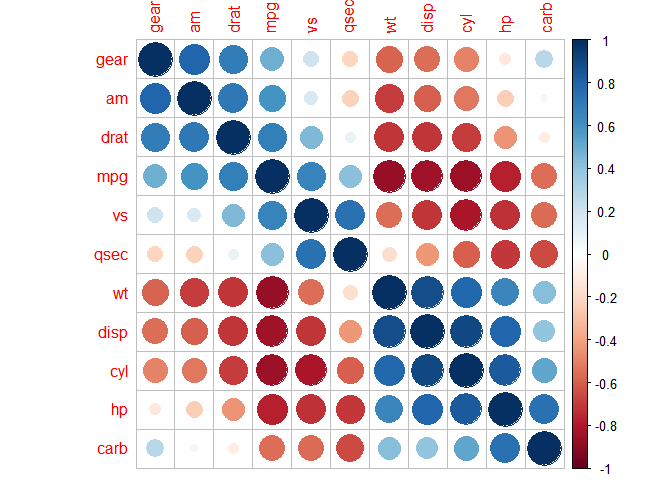

Correlation plot
================

# 상관계수

  - 상관계수는 두 변수의 선형적 관계에 대해서 알려준다. <br>
  - 몰론 절대적으로 맞는것은 아니다. <br>
  - outlier 가 있으면 낮게나오고, 선형이 아닌 다른 관계는 잡지 못하는 등 단점이 많음 <br>
  - 즉 절대적인게 아니라 참고용으로 알아두는게 좋을것이다. <br>
  - 아래와 같이 두 방법이 시각적으로 제일 좋아서 알아두면 좋다. <br>

## Corrplot

``` r
library(corrplot)
```

    ## corrplot 0.84 loaded

``` r
df_cor= cor(mtcars)
corrplot(df_cor,method = 'square')
```

<!-- -->

``` r
corrplot(df_cor,method = 'number')
```

<!-- -->

``` r
corrplot(df_cor, method = "color", addCoef.col="grey", order = "AOE")
```

<!-- -->

## Corranalysis

performance Analytic 이라는 패키지 에서 산점도와 히스토그램을 같이 볼 수 있다.

``` r
library("PerformanceAnalytics")
```

    ## Loading required package: xts

    ## Loading required package: zoo

    ## 
    ## Attaching package: 'zoo'

    ## The following objects are masked from 'package:base':
    ## 
    ##     as.Date, as.Date.numeric

    ## 
    ## Attaching package: 'PerformanceAnalytics'

    ## The following object is masked from 'package:graphics':
    ## 
    ##     legend

``` r
my_data <- mtcars[, c(1,3,4,5,6,7)]
chart.Correlation(my_data, histogram=TRUE, pch=19)
```

<!-- -->

## 군집화

  - corr plot 에서는 재정렬을 통해서 상관계수가 큰 값끼리 엮어주는것이 중요하다. <br>
  - 그러한 재정렬을 도와주는 방식이 몇가지 있다 <br>
      - AOE(angle of eigenvector) : 고유벡터의 각 순서로 정렬
      - FPC(Firsr principal component order) : 첫번째 주요성분 순서로 정렬
      - hclust(hierachical clustering order) : 계층적 군집순서로 정렬

<!-- end list -->

``` r
corrplot(df_cor,order="AOE")
```

<!-- -->

``` r
corrplot(df_cor,order="FPC")
```

<!-- -->

``` r
corrplot(df_cor,order="hclust",addrect=3) # 이 경우 addrect 로 사각형 군집맵 가능
```

<!-- -->
