데이터 시각화 기초
================

# 전체 구성 결정

  - plot 명령어를 하게되면 r 은 기본 설정에 따라 별도의 윈도우를 열고 한개의 그래프를 그리게 된다.

## split.screen(c())

하나의 윈도우에 그림을 여러개 그릴 수 있게 한다.

``` r
split.screen(c(2,1))
```

    ## [1] 1 2

``` r
screen(1) # 그림을 그릴 위치를 지정해준다.
plot(1:10)
screen(2)
plot(10:1)
```

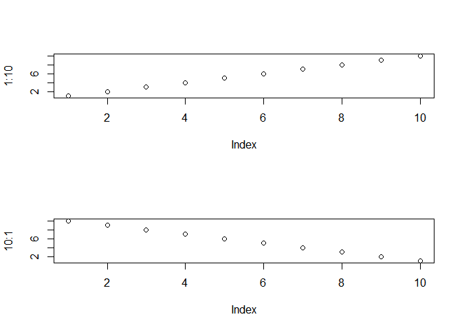<!-- -->

## par(mfrow=c()) / par(mfcol=c())

위와같음. 다만 순서가(row/col)순서대로 그려지게 된다.

``` r
par(mfrow=c(2,1))
plot(1:10)
plot(10:1)
```

<!-- -->

## 모든 설정을 초기화 한다.

``` r
dev.off()
```

    ## null device 
    ##           1

# 그래프 옵션

``` r
x <- seq(1,10,1)
y <- 1.5^x
plot(x,y)
```

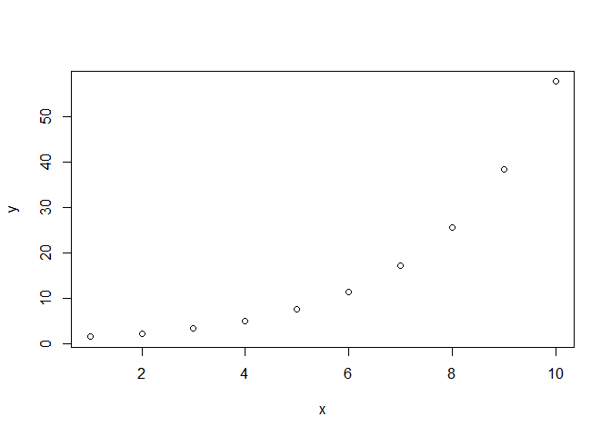<!-- -->

## 기본옵션

  - plot(x,y, main = ‘main’) \#main = ‘제목’
  - plot(x,y, sub = “subtitle”) \#sub = ‘부제목’
  - plot(x,y, xlab = ‘x name’) \#xlab = ‘x축이름’
  - plot(x,y, ylab = “y name”) \#ylab = ‘y축이름’
  - plot(x,y, ann = F) \#ann = F : x,y축 제목을 설정하지 않음
  - plot(x,y, axes =F) \#axes = F : x,y 축을 표시하지 않음

<!-- end list -->

``` r
plot(x,y, main = 'main')    #main = '제목'
```

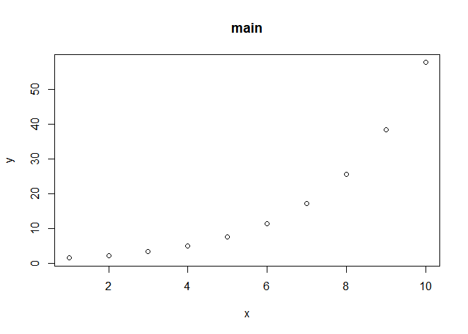<!-- -->

``` r
plot(x,y, sub = "subtitle") #sub = '부제목'
```

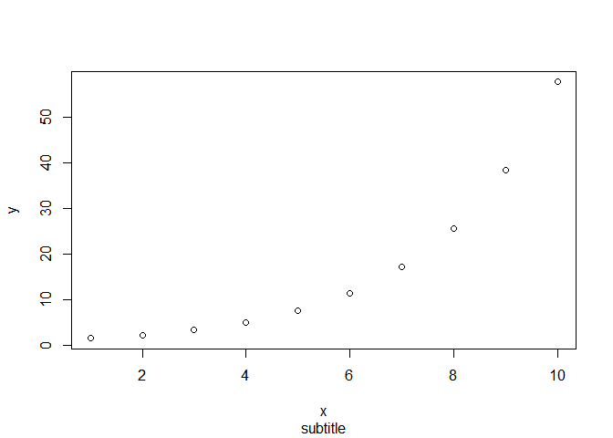<!-- -->

``` r
plot(x,y, xlab = 'x name')  #xlab = 'x축이름' 
```

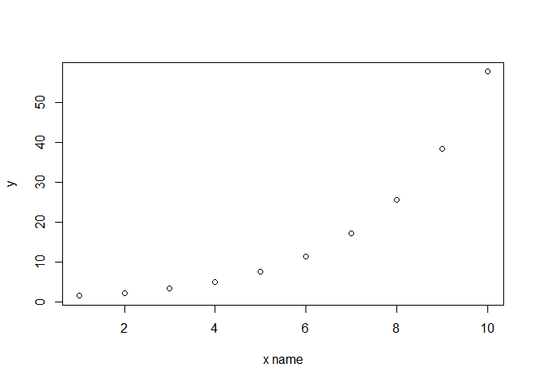<!-- -->

``` r
plot(x,y, ylab = "y name")  #ylab = 'y축이름'
```

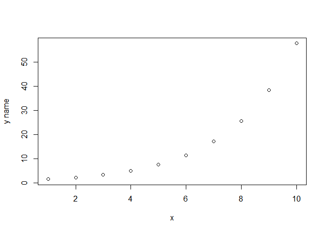<!-- -->

``` r
plot(x,y, ann = F)          #ann = F : x,y축 제목을 설정하지 않음
```

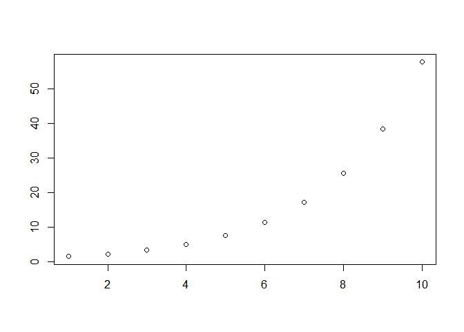<!-- -->

``` r
plot(x,y, axes =F)           #axes = F : x,y 축을 표시하지 않음
```

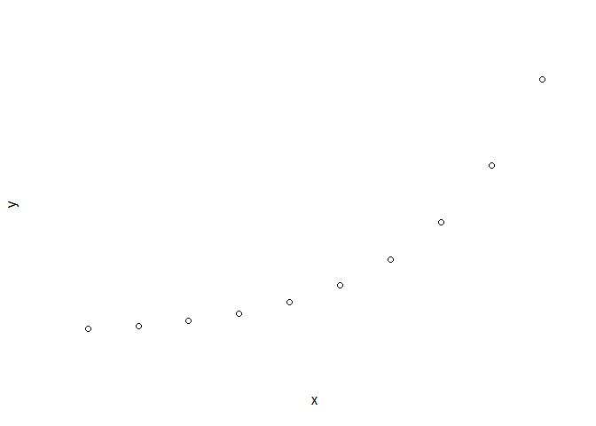<!-- -->

## 그래프타입

``` r
plot(x,y, type = "l") #l : 선모양
```

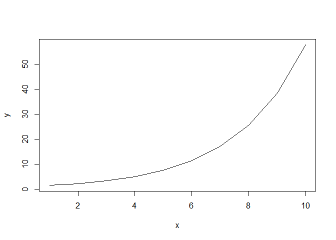<!-- -->

``` r
plot(x,y, type = "b") #b : 점과 선모양
```

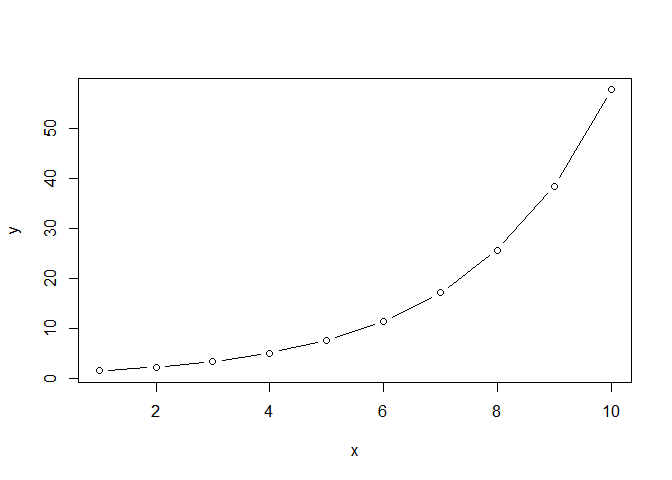<!-- -->

``` r
plot(x,y, type = "c") #c : b 에서 점을 생략
```

<!-- -->

``` r
plot(x,y, type = "o") #o : 점과 선 중첩
```

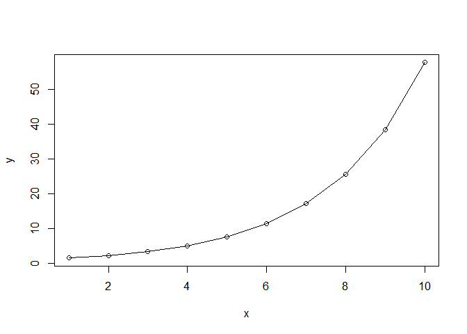<!-- -->

``` r
plot(x,y, type = "h") #h : 각 점에서 x 축까지의 수직선
```

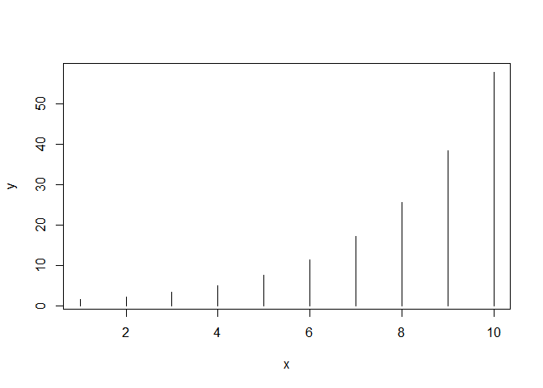<!-- -->

``` r
plot(x,y, type = "s") #s : 왼쪽값을 기초로 계단모양 연결
```

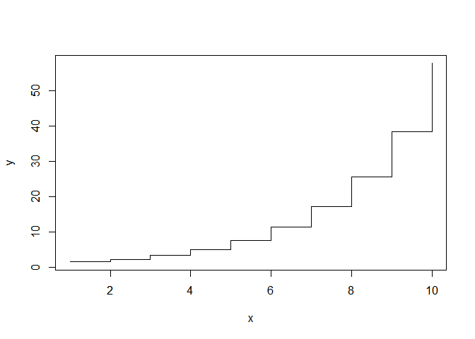<!-- -->

``` r
plot(x,y, type = "S") #S : 오른쪽값을 기초로 계단모양 연결
```

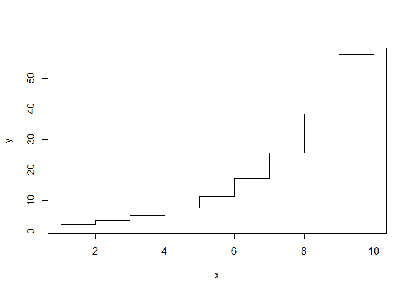<!-- -->

``` r
plot(x,y, type = "n") #n : 축만 그리고 그래프는 그리지 않음 (그럼이거 왜써?)
```

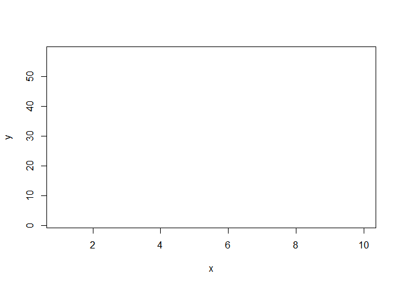<!-- -->

## 선 모양

``` r
plot(x,y, type="l", lty = 0) #0 : 투명선
```

<!-- -->

``` r
plot(x,y, type="l", lty = 1) #1 : 실선
```

<!-- -->

``` r
plot(x,y, type="l", lty = 2) #2 : 대쉬 선
```

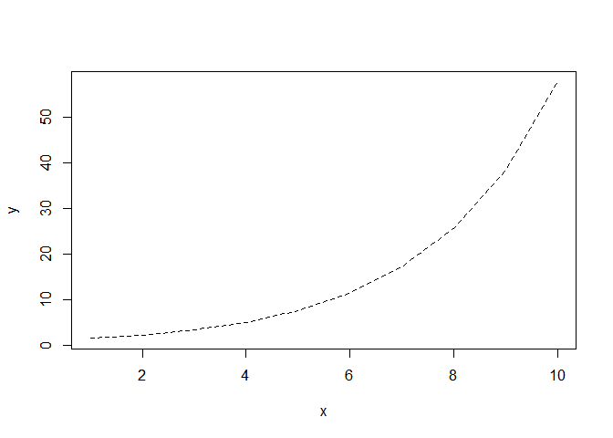<!-- -->

``` r
plot(x,y, type="l", lty = 3) #3 : 점선
```

<!-- -->

``` r
plot(x,y, type="l", lty = 4) #4 : 점선과 대쉬선
```

<!-- -->

``` r
plot(x,y, type="l", lty = 5) #5 : 긴 대쉬선
```

<!-- -->

``` r
plot(x,y, type="l", lty = 6) #6 : 두개의 대쉬선
```

<!-- -->

``` r
## 색/기호/굵기
plot(x,y,col='red') #기호 색 지정. red/blue/green 등등 가능
```

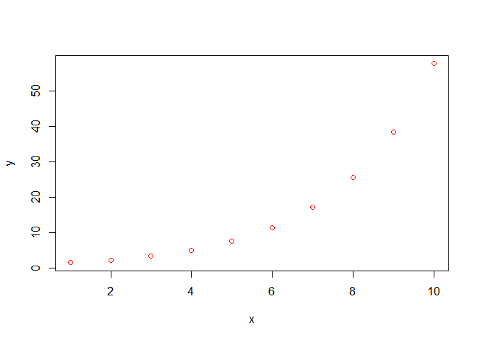<!-- -->

``` r
plot(x,y,pch=1) # 점 모양 지정
```

<!-- -->

``` r
plot(x,y,pch=2)
```

<!-- -->

``` r
plot(x,y,pch=3)
```

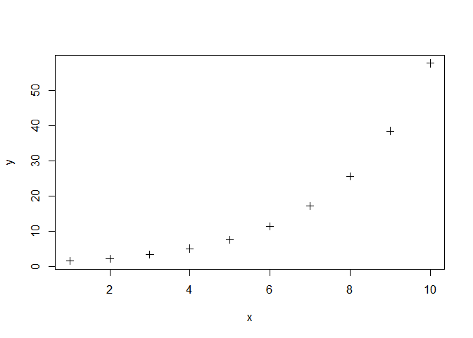<!-- -->

``` r
plot(x,y,pch=4)
```

<!-- -->

``` r
plot(x,y,pch=5)
```

<!-- -->

``` r
plot(x,y,pch=6)
```

<!-- -->

``` r
plot(x,y,pch=7)
```

<!-- -->

``` r
plot(x,y,pch=8) 
```

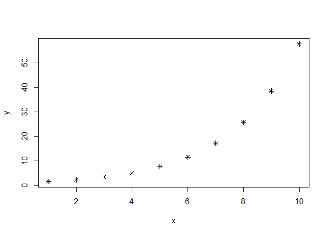<!-- -->

``` r
plot(x,y,pch=9)
```

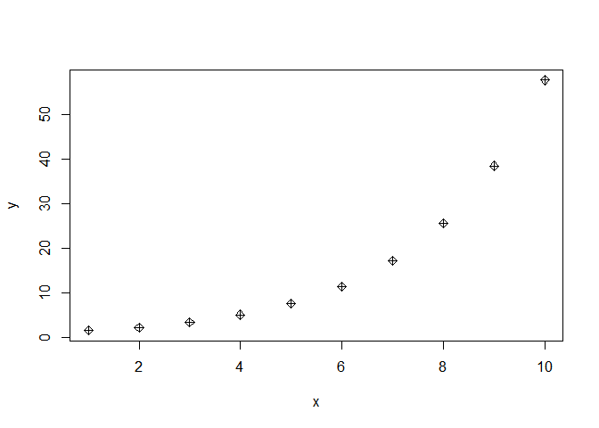<!-- -->

``` r
plot(x,y,type='l',lwd=9) # lwd = 선의 굵기
```

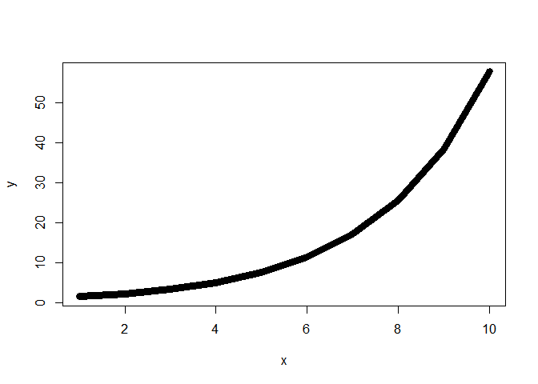<!-- -->

``` r
plot(x,y,cex=10) # cex = 도형의 크기
```

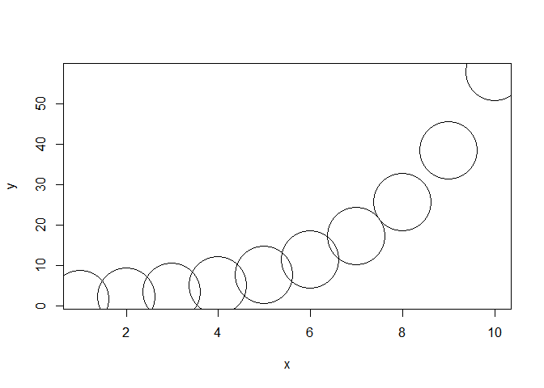<!-- -->

## 범례 추가

``` r
a <- c(26,30,25,28,31)
b <- c(18,20,21,19,17)
c <- c(21,25,26,21,27)
plot(a, type ='o' , pch=1 , col='red', ylim=c(0,40))
lines(b,type ='o' , pch=6 , col='blue')
lines(c,type ='o' , pch=3 , col='black')
legend(4,40, # legend 가 위치할곳
       c('apple','cherry','banana'), # 각 legend 의 이름
       col=c('red','black','green'), # legend 의 색깔
       pch=c(1,6,3), # pch 타입
       lty=c(1,1,1)) # line 타입
```

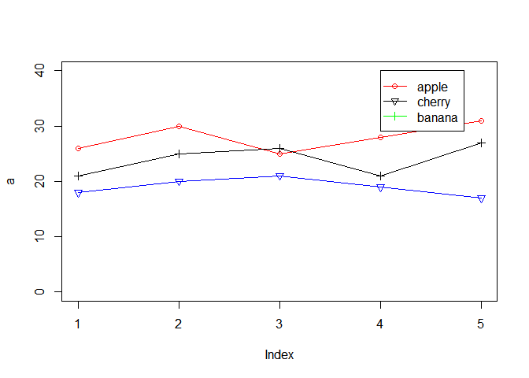<!-- -->

# 그림 기초

## 산점도

``` r
plot(trees$Girth,trees$Height)
```

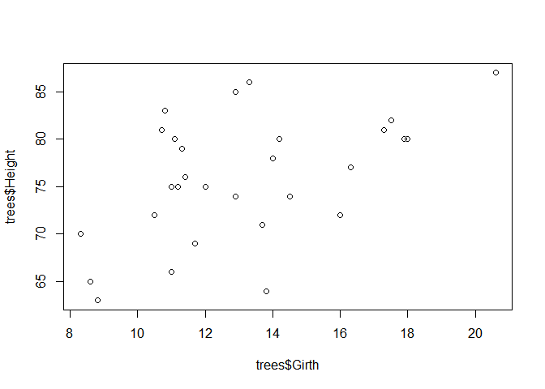<!-- -->

## 산점도 행렬

``` r
# 무작정 plot 을 dataframe 에 때려넣으면 산점도 행렬이 만들어진다.
plot(iris) 
```

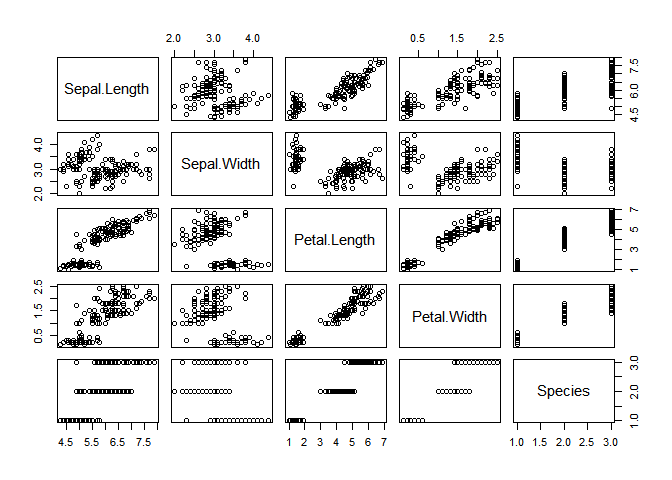<!-- -->

``` r
# pairs 를 써도 같은 효과를 가질 수 있다.
pairs(iris[1:4]) 
```

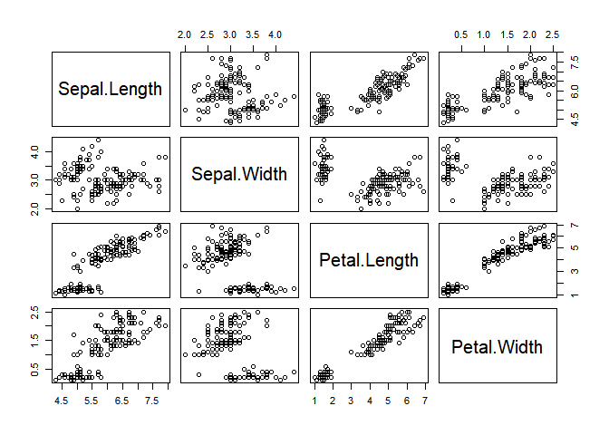<!-- -->

``` r
# 이 떄에 bg(그래프 배경색지정) 을 통해서 각 점들의 색깔을 지정해줄 수 있다.
plot(iris[1:4],
     col=c('red','green','black')[unclass(iris$Species)])
```

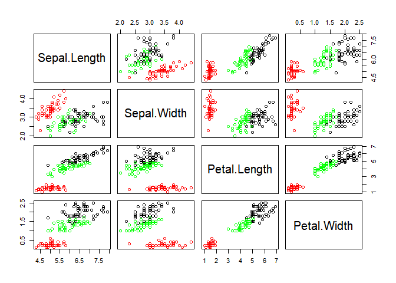<!-- -->

``` r
# 이렇게 vector 옆에 indexing 을 중복해서 하면 반복해서 element 가 나온다는걸 이용하면 된다. 
c('t','d','g')[c(1,1,2)]
```

    ## [1] "t" "t" "d"

## 히스토그램

``` r
hist(iris$Sepal.Length) 
```

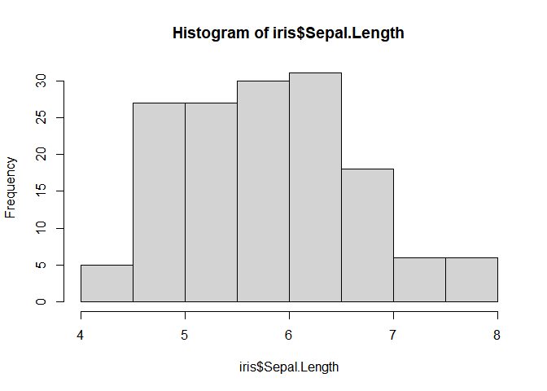<!-- -->

## 상자그림

``` r
boxplot(iris$Sepal.Length)
```

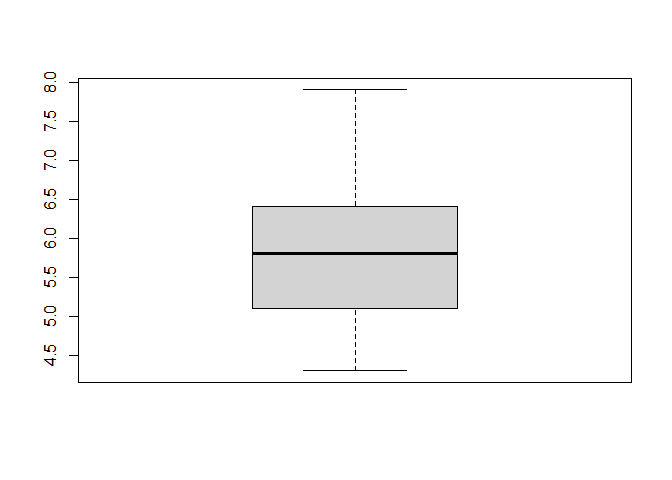<!-- -->
