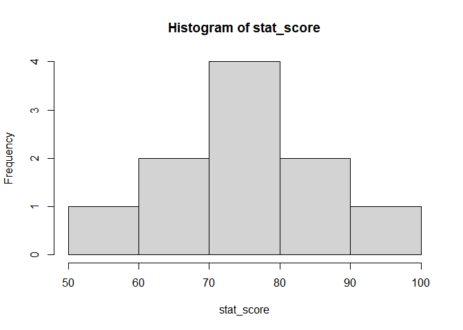

데이터 변환
================

``` r
student_id <- c("s01", "s02", "s03", "s04", "s05", "s06", "s07", "s08", "s09", "s10")
stat_score <- c(56, 94, 82, 70, 64, 82, 78, 80, 76, 78)
mean(stat_score)
```

    ## [1] 76

``` r
hist(stat_score)
```

<!-- -->

# 연속형 -\> 범주형

ifelse 를 반복적으로 쓰게되면, 각 값마다 알맞게 범주형으로 고칠 수 있다.

``` r
score_d.f <- data.frame(student_id, stat_score)
score_d.f
```

    ##    student_id stat_score
    ## 1         s01         56
    ## 2         s02         94
    ## 3         s03         82
    ## 4         s04         70
    ## 5         s05         64
    ## 6         s06         82
    ## 7         s07         78
    ## 8         s08         80
    ## 9         s09         76
    ## 10        s10         78

``` r
attach(score_d.f)
```

    ## The following objects are masked _by_ .GlobalEnv:
    ## 
    ##     stat_score, student_id

``` r
score_d.f <- transform(score_d.f, 
                       stat_score_5 = ifelse(stat_score < 60, "가", 
                                             ifelse(stat_score >= 60 & stat_score < 70, "양", 
                                                    ifelse(stat_score >= 70 & stat_score < 80, "미", 
                                                           ifelse(stat_score >= 80 & stat_score < 90, "우", "수")))))
detach(score_d.f)
score_d.f
```

    ##    student_id stat_score stat_score_5
    ## 1         s01         56           가
    ## 2         s02         94           수
    ## 3         s03         82           우
    ## 4         s04         70           미
    ## 5         s05         64           양
    ## 6         s06         82           우
    ## 7         s07         78           미
    ## 8         s08         80           우
    ## 9         s09         76           미
    ## 10        s10         78           미

# 데이터 정규화

평균0 분산1 의 데이터를 가지도록 정규화

``` r
scale_score1= scale(score_d.f$stat_score)
scale_score1
```

    ##             [,1]
    ##  [1,] -1.8973666
    ##  [2,]  1.7076299
    ##  [3,]  0.5692100
    ##  [4,] -0.5692100
    ##  [5,] -1.1384200
    ##  [6,]  0.5692100
    ##  [7,]  0.1897367
    ##  [8,]  0.3794733
    ##  [9,]  0.0000000
    ## [10,]  0.1897367
    ## attr(,"scaled:center")
    ## [1] 76
    ## attr(,"scaled:scale")
    ## [1] 10.54093

``` r
attributes(scale_score1)
```

    ## $dim
    ## [1] 10  1
    ## 
    ## $`scaled:center`
    ## [1] 76
    ## 
    ## $`scaled:scale`
    ## [1] 10.54093

``` r
# 어떻게 표준화 시켰는지 알려준다.
# 이 값을 통해 표준화  하기 전 값으로 돌려갈 수있다.
```

# Min-max scailing

\[0,1\] 사이의 값을 가지게 스케일링이 된다.

``` r
# [0-1] 의 값을 가지도록 정규화
k = score_d.f$stat_score 
scale_score2 = (k- min(k))/(max(k)-min(k))
scale_score2
```

    ##  [1] 0.0000000 1.0000000 0.6842105 0.3684211 0.2105263 0.6842105 0.5789474
    ##  [8] 0.6315789 0.5263158 0.5789474

\#log/sqrt 변환 주로 분산 안정화를 위해 사용.

``` r
x = score_d.f$stat_score 
sqrt(x) 
```

    ##  [1] 7.483315 9.695360 9.055385 8.366600 8.000000 9.055385 8.831761 8.944272
    ##  [9] 8.717798 8.831761

``` r
log(1+x) # 로그는 0에 가깝게 되는 경우 inf 로 발산하기때문에 주로 1+x 변환을 쓴다.
```

    ##  [1] 4.043051 4.553877 4.418841 4.262680 4.174387 4.418841 4.369448 4.394449
    ##  [9] 4.343805 4.369448
